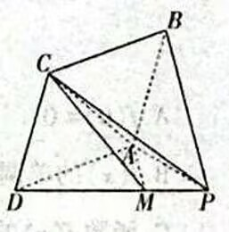

# 2026年普通高考二月适应性检测

## 数学

（卷面分值：150分 考试时间：120分钟）

### 注意事项：

1. 答卷前，考生务必将自己的姓名、准考证号填写在答题卡的相应位置上。
2. 作答时，将答案写在答题卡上，写在本试卷上无效。
3. 考试结束后，将本试卷和答题卡一并交回。

---

## 一、选择题：本题共8小题，每小题5分，共40分。在每小题给出的四个选项中，只有一项是符合题目要求的。

1. 已知集合 $A = \{x \in \mathbb{R} \mid x^3 - 1 = 0\}$, $B = \{0, a-1, 3\}$, 若 $A \subseteq B$, 则 $a =$
   - A. 0
   - B. 1
   - C. 2
   - D. 0 或 2

2. 若复数 $z$ 满足 $\frac{1}{z} = i$, 则 $\bar{z} =$
   - A. $i$
   - B. $-i$
   - C. $1+i$
   - D. $1-i$

3. 设向量 $\vec{a}, \vec{b}$ 为单位向量，且 $|\vec{a} + 2\vec{b}| = \sqrt{3}$, 则向量 $\vec{a}, \vec{b}$ 的夹角为
   - A. $\frac{\pi}{6}$
   - B. $\frac{\pi}{3}$
   - C. $\frac{\pi}{2}$
   - D. $\frac{2\pi}{3}$

4. 某高三毕业班有50人，若同学之间两两彼此给对方写一条毕业留言，那么全班共写了毕业留言
   - A. 2450条
   - B. 1875条
   - C. 1225条
   - D. 675条

5. 已知椭圆 $C: \frac{x^2}{16} + \frac{y^2}{b^2} = 1$ 的左、右焦点分别为 $F_1, F_2$, $O$ 为坐标原点，$P$ 为椭圆 $C$ 上一点，$Q$ 为 $PF_2$ 中点，若 $\triangle QOF_2$ 的周长为6，则椭圆 $C$ 的短轴长为
   - A. $2\sqrt{3}$
   - B. $4\sqrt{3}$
   - C. 2
   - D. 4

6. 已知 $a, b > 0$, 且 $a \neq 1, b \neq 1$, 若 $\log_a b > 1$, 则
   - A. $(a-1)(b-1) < 0$
   - B. $(a-1)(a-b) > 0$
   - C. $(b-1)(b-a) < 0$
   - D. $(b-1)(b-a) > 0$

7. 已知 $\alpha \in (\pi, 2\pi)$, 且 $3\cos\alpha - 8\cos\frac{\alpha}{2} = 5$, 则 $\sin\alpha =$
   - A. $\frac{4\sqrt{5}}{9}$
   - B. $\frac{\sqrt{5}}{2}$
   - C. $-\frac{4}{9}$
   - D. $-\frac{4\sqrt{5}}{27}$

8. 已知 $\triangle ABC$ 的三个顶点坐标分别为 $A(-1,3), B(-1,-2), C(4,-2)$, 若以原点为圆心的圆与此三角形有唯一的公共点，则圆的方程为
   - A. $x^2+y^2=2$ 或 $x^2+y^2=10$
   - B. $x^2+y^2=1$ 或 $x^2+y^2=20$
   - C. $x^2+y^2=4$ 或 $x^2+y^2=10$
   - D. $x^2+y^2=3$ 或 $x^2+y^2=30$

---

## 二、选择题：本题共3小题，每小题6分，共18分。在每小题给出的选项中，有多项符合题目要求。全部选对的得6分，部分选对的得部分分，有选错的得0分。

9. 设 $\alpha, \beta$ 为两个平面，$m, n$ 为两条直线，且 $\alpha \cap \beta = m$, 则下列说法正确的是
   - A. 若 $n // \alpha$ 或 $n // \beta$, 则 $m // n$
   - B. 若 $m // n$, 则 $n // \alpha$ 或 $n // \beta$
   - C. 若 $n \perp \alpha$ 或 $n \perp \beta$, 则 $m \perp n$
   - D. 若 $m \perp n$, 则 $n \perp \alpha$ 或 $n \perp \beta$

10. 已知各项均为正数的数列 $\{a_n\}$ 满足 $a_n a_{n+1} = (\sin\alpha)^n \left(0 < \alpha \leqslant \frac{\pi}{2}\right)$, 且数列 $\{a_n\}$ 的前 $n$ 项积为 $T_n$, 则下列说法正确的是
    - A. 若 $\alpha = \frac{\pi}{2}$, 则 $T_{2n} = 1$
    - B. 若 $\alpha = \frac{\pi}{6}, a_1 = \frac{1}{2}$, 则 $a_4 = \frac{1}{16}$
    - C. 对任意 $\alpha$ 及正整数 $k$, 都有 $a_{2k+1} \leqslant a_{2k-1}$
    - D. 若 $\{a_n\}$ 为等比数列，则 $a_1 = \sqrt[4]{\sin\alpha}$

11. 已知函数 $f(x) = \begin{cases} 
\frac{1}{e^{|\ln x|}}, & x \in (0, +\infty) \\
\ln\frac{1}{1-x}, & x \in (-\infty, 0]
\end{cases}$, 则下列说法正确的是
    - A. $f(0) = 0$
    - B. $f(x)$ 的单调递增区间为 $(-\infty, 0)$ 和 $(1, +\infty)$
    - C. 函数 $f(x)$ 的图象与直线 $x+y+c=0 (c \in \mathbb{R})$ 有且仅有一个交点
    - D. 若 $f(x_1) = f(x_2) = f(x_3)$, 且 $x_1 < x_2 < x_3$, 则 $(1-x_1)(x_2+x_3)$ 有最小值

---

### 三、填空题：本题共3小题，每小题5分，共15分。

12. 已知 $S_n$ 是等差数列 $\{a_n\}$ 的前 $n$ 项和，若 $\frac{a_{15}}{a_6} = 10$，则 $\frac{S_{20}}{S_{11}} =$ ________.

13. 若函数 $f(x) = \cos x - a(e^x + e^{-x}) + 1$ 有唯一零点，则 $a =$ ________.

14. 若正方体内部有两个球，其中球 $O_1$ 与正方体的三个面相切，球 $O_2$ 与正方体的六个面均相切，球 $O_1$ 与球 $O_2$ 也相切，设球 $O_1$、球 $O_2$ 的表面积分别为 $S_1, S_2$，则 $\frac{S_1}{S_2} =$ ________.

---

### 四、解答题：本题共5小题，共77分。解答应写出文字说明、证明过程或演算步骤。

15. (13分) 在 $\triangle ABC$ 中，角 $A, B, C$ 的对边分别为 $a, b, c$，已知 $a \cos B - b \cos A = b + c$，$D$ 为 $BC$ 的中点。

    (1) 求角 $A$；

    (2) 若 $a = 2\sqrt{7}, AD = \sqrt{3}$，求 $\triangle ABC$ 的面积。

16. (15分) 已知 $f(x) = (2x - 1)e^{ax} - x$ 在 $x=0$ 处的切线方程为 $x+y+b=0$。

    (1) 求实数 $a, b$ 的值；

    (2) 证明：$f(x)$ 仅有一个极值点 $x_0$，且 $f(x_0) < -\frac{3}{4}$。

17. (15分) 如图，在以 $P,A,B,C,D$ 为顶点的多面体中，四边形 $ABCD$ 为菱形，平面 $ABCD \perp$ 平面 $PAD$，$AD=AP$，$\angle ADP=30^\circ$，点 $M$ 在边 $PD$ 上，$AM=MP$。

    

    (1) 求证：$AM \perp CD$；

    (2) 若 $\angle ADC=60^\circ$，求平面 $ACM$ 与平面 $BCP$ 所成角的正弦值。

18. (17分) 已知双曲线 $C: \frac{x^2}{a^2} - \frac{y^2}{b^2} = 1 (a>0, b>0)$ 的右顶点是抛物线 $E: y^2=4x$ 的焦点，过双曲线 $C$ 的右焦点作斜率不为0的直线与抛物线 $E$ 交于 $A, B$ 两点，且 $\overrightarrow{OA} \cdot \overrightarrow{OB} = -4$。

    (1) 求双曲线 $C$ 的方程；

    (2) 点 $P$ 在双曲线 $C$ 的左支上，过点 $P$ 作抛物线 $E$ 的两条切线，其斜率分别为 $k_1, k_2$，求 $k_1^2 + k_2^2$ 的最大值。

19. (17分) 在正方形轨道 $ABCD$ 的顶点 $A$ 处有一个机器人，它每次移动会以 $p$ 的概率顺时针移动到轨道上相邻的顶点，或以 $1-p$ 的概率逆时针移动到轨道上相邻的顶点。

    (1) 若 $p=\frac{1}{3}$，设机器人移动 $n$ 次后在顶点 $A$ 的概率为 $P_n$。

     -(i) 求 $P_1$, $P_2$；

     -(ii) 求 $P_n$。

    (2) 设机器人首次回到顶点 $A$ 所移动的次数为随机变量 $X$，证明：对任意 $p \in (0,1), E(X)$ 为定值。

---
