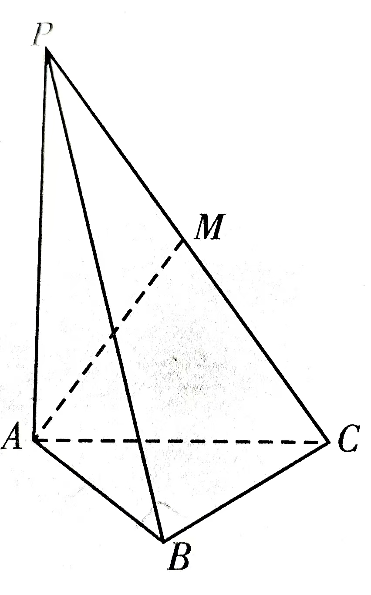

# 乌鲁木齐地区 2026 年高三年级第二次质量监测
**数学(问卷)**  
(卷面分值: 150 分; 考试时间: 120 分钟)

**注意事项：**
1. 本试卷分为问卷(4 页)和答卷(4 页)，答案务必书写在答卷(或答题卡)的指定位置上.
2. 答题前，先将答卷密封线内的项目(或答题卡中的相关信息)填写清楚.

---

## 第Ⅰ卷 (选择题 共 58 分)

### 一、选择题
本大题共 8 小题，每小题 5 分，共计 40 分。在每小题给出的四个选项中只有一项是符合题目要求的。请把正确的选项填涂在答题卡相应的位置上。

1. 在复平面内，$i(1+i)$ 对应的点位于
  
   A. 第一象限  
   B. 第二象限  
   C. 第三象限  
   D. 第四象限

2. 已知集合 $A=\{x \mid x^2-2x-3<0\}, B=\{-1,0,1,2,3\}$，则 $A \cap B=$
   
   A. $\{-1,0\}$  
   B. $\{-1,0,1\}$  
   C. $\{0,1,2\}$  
   D. $\{-1,0,1,2,3\}$

3. 已知中心在原点，对称轴在坐标轴上的椭圆，其一个顶点是 $(0, 8)$，一个焦点是 $(6, 0)$，以下为椭圆顶点的是
  
   A. $(-10,0)$  
   B. $(-6,0)$  
   C. $(8,0)$  
   D. $(0,10)$

4. $(1+2x)(1+x)^5$ 的展开式中 $x^2$ 的系数是
   
   A. 10  
   B. 15  
   C. 20  
   D. 30

5. 已知函数 $f(x)=\sin(\omega x + \varphi)$ ($\omega>0, |\varphi|<\frac{\pi}{2}$) 的图象关于直线 $x=\frac{3\pi}{4}$ 对称，则 $f(x)$ 的一个对称中心为
  
   A. $(-\frac{\pi}{4}, 0)$  
   B. $(\frac{\pi}{4}, 0)$  
   C. $(\frac{\pi}{3}, 0)$  
   D. $(\frac{\pi}{2}, 0)$

6. 曲线 $f(x)=e^{2x}$ 过坐标原点的切线方程为
  
   A. $y=\frac{1}{2}ex$  
   B. $y=ex$  
   C. $y=e^2x$  
   D. $y=2ex$

7. 已知函数 $f(x)$ 定义域为 $\mathbb{R}$，若 $f(1-x)=f(x-1)$，$f(x)-2^x$ 为奇函数，则 $f(1)=$
   
   A. $\frac{5}{4}$  
   B. $\frac{3}{4}$  
   C. $\frac{5}{2}$  
   D. $\frac{3}{2}$

8. 已知双曲线 $\frac{x^2}{a^2} - \frac{y^2}{b^2}=1$ ($a>0, b>0$)，$F$ 为右焦点，过 $F$ 作一条渐近线的垂线，垂足为 $A$，交另一条渐近线于点 $B$，点 $A$，$B$ 在 $y$ 轴两侧，$S_{\triangle OAB}=ab$，则双曲线的离心率是
  
   A. $\sqrt{2}$  
   B. $\sqrt{3}$  
   C. $2$  
   D. $3$

### 二、选择题
本大题共 3 小题，每小题 6 分，共计 18 分。在每小题给出的四个选项中，有多项符合题目要求。全部选对得 6 分，部分选对得部分分，有选错的得 0 分。

9. 已知直线 $a$，$b$ 及平面 $\alpha$，$\beta$。下列命题中正确的是
   
   A. 若 $a \parallel \alpha, \alpha \cap \beta = b$，则 $a \parallel b$  
   B. 若 $a \perp \alpha, b \perp \alpha$，则 $a \parallel b$  
   C. 若 $a \parallel \alpha, b \perp a$，则 $b \perp \alpha$  
   D. 若 $a \perp \alpha, a \parallel \beta$，则 $\alpha \perp \beta$

10. 已知圆 $C_1: x^2+y^2=1$ 和圆 $C_2: (x-\sqrt{2})^2+(y-\sqrt{2})^2=1$，则下列直线与两圆都相切的是
    
    A. $x+y+\sqrt{2}=0$  
    B. $x+y-\sqrt{2}=0$  
    C. $x-y+\sqrt{2}=0$  
    D. $x-y-\sqrt{2}=0$

11. 将一个质地均匀的正方体骰子独立地抛掷 3 次，则
   
    A. 三次点数均为偶数的概率是 $\frac{1}{8}$  
    B. 三次点数和为 9 的概率是 $\frac{25}{216}$  
    C. 事件“三次点数有且仅有一次为 6”与事件“三次点数之和为 9”相互独立  
    D. 在三次点数互不相同的条件下，点数之和为 9 的概率是 $\frac{3}{20}$

---

## 第Ⅱ卷 (非选择题 共 92 分)

### 三、填空题
本大题共 3 小题，每小题 5 分，共计 15 分。

12. 已知函数 $f(x)= \lg x$，若 $f(a)+f(b)=1$，则 $ab$ 的值为 \_\_\_\_\_\_\_\_。

13. 已知向量 $\mathbf{a}, \mathbf{b}$ 为单位向量，且 $\mathbf{a} \perp \mathbf{b}$，若 $\mathbf{c}=\mathbf{a}-2\mathbf{b}$，则 $\cos \langle \mathbf{a}, \mathbf{c} \rangle =$ \_\_\_\_\_\_\_\_。

14. 若正整数 $a$，$b$ 满足 $a^b = b^a$，则 $a^b + b^a$ 的最大值为 \_\_\_\_\_\_\_\_。

---

### 四、解答题
本大题共 5 小题，共计 77 分。解答应在答卷的相应各题中写出文字说明，证明过程或演算步骤。

15. (13分) 某高校为调查学生对AI知识掌握的熟悉程度与学历是否有关，组织了相关的答题活动，满分100分。答题完成后，工作人员从中随机抽取200人作为样本，得到如下数据。

| 学历 / 分数人数 | [40,50) | [50,60) | [60,70) | [70,80) | [80,90) | [90,100] |
| :--- | :---: | :---: | :---: | :---: | :---: | :---: |
| 本科及以下 | 37 | 33 | 12 | 10 | 5 | 3 |
| 本科以上 | 22 | 28 | 18 | 14 | 11 | 7 |

(Ⅰ) 试估计样本得分的第75百分位数；

(Ⅱ) 若得分不小于60分，则认为学生对AI知识掌握的程度为熟悉，否则为不熟悉；

| 熟悉程度 / 学历 | 本科及以下 | 本科以上 | 合计 |
| :--- | :---: | :---: | :---: |
| 熟悉 | | | |
| 不熟悉 | | | |
| 合计 | | | |

根据样本数据补全上面的 $2 \times 2$ 列联表，并依据小概率值 $\alpha=0.01$ 的独立性检验，能否认为熟悉程度与参与人员学历有关系。

**附：**
$$ \chi^{2} = \frac{n (ad - bc)^2}{(a+b)(c+d)(a+c)(b+d)} , \quad n = a + b + c + d $$

| $\alpha$ | 0.05 | 0.01 | 0.001 |
| :--- | :---: | :---: | :---: |
| $x_\alpha$ | 3.841 | 6.635 | 10.828 |

16. (15分) 已知等差数列 $\{a_n\}$ 的前 $n$ 项和为 $S_n$，且 $S_{2n} = 4 S_{n}$，$a_{2n} = 2 a_{n} + 1$ ($n \in \mathbb{N}^{*}$)。

(Ⅰ) 求数列 $\{a_n\}$ 的通项公式；

(Ⅱ) 若 $b_n = \frac{1}{a_n a_{n+1}}$，求数列 $\{b_n\}$ 的前 $n$ 项和 $T_n$。

17. (15分) 在 $\triangle ABC$ 中，$BC=3$，$D$ 在 $BC$ 上，记 $\angle BAD=\alpha$，$\angle CAD=\beta$，$\sin C \sin \alpha = 2 \sin B \sin \beta$。

(Ⅰ) 求 $BD$;

(Ⅱ) 若 $\angle BAC = \frac{\pi}{3}$，$AC = \sqrt{3}$，求 $AD$。

18. (17分) 如图，在三棱锥 $P-ABC$ 中，$PA \perp$ 平面 $ABC$，$AB \perp BC$。

(Ⅰ) 求证: 平面 $PAB \perp$ 平面 $PBC$;

(Ⅱ) 设 $PA = 2AB = 2BC = 4$，$\overrightarrow{CM} = \lambda \overrightarrow{CP}$ ($0 < \lambda < 1$)，点 $M, A, B, C$ 均在球 $O$ 的球面上。

(i) 当 $\lambda = \frac{1}{2}$ 时，求球 $O$ 的表面积；

(ii) 设球 $O$ 的球面与直线 $PA$ 交于点 $G$ (异于点 $A$)，求直线 $BG$ 与平面 $PBC$ 所成角最大时 $\lambda$ 的值。

1.  (17分) 已知圆心在 $x$ 轴上移动的圆经过点 $P(-2, 0)$，且与 $x$ 轴，$y$ 轴分别交于 $M(x,0)$, $N(0,y)$ 两个动点，设动点 $Q(x,y)$ 的轨迹为 $E$。

(Ⅰ) 求 $E$ 的方程;

(Ⅱ) 已知正 $\triangle ABC$ 的三个顶点在 $E$ 上。

(i) 若 $AB$ 中点 $D$ 的坐标为 $(\frac{13}{2}, 1)$，求点 $C$ 的坐标；

(ii) 求满足 $A$ 点纵坐标为 $1$ 的 $\triangle ABC$ 的个数，并说明理由。