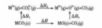

1. 下列金属中，金属阳离子与自由电子间的作用力最强的是（C ）
   
   A. $\text{Al}$  
   B. $\text{K}$  
   C. $\text{Cu}$  
   D. $\text{Zn}$

---

2. [江苏宿迁 2025 高二调研] 下列性质中，能充分说明某晶体是离子晶体的是（B ）
   
   A. 具有较高的熔点  
   B. 固态不导电，水溶液能导电  
   C. 可溶于水  
   D. 固态不导电，熔融状态能导电

---

3. [江西赣州 2024 月考] 下列有关离子晶体的数据大小比较不正确的是（ ）

    A. 稳定性：$\text{NaF} > \text{NaCl} > \text{NaBr}$  
    B. 熔点：$\text{NaF} > \text{MgF}_2 > \text{AlF}_3$  
    C. 硬度：$\text{MgO} > \text{CaO} > \text{BaO}$  
    D. 阴离子配位数：$\text{CsCl} > \text{NaCl} > \text{CaF}_2$

---

1. [河南驻马店 2025 高二月考] $\text{MgCO}_3$ 和 $\text{CaCO}_3$ 的能量关系如图所示（$\text{M}= \text{Ca}, \text{Mg}$）。

    

    已知：离子所带电荷数相同时，半径越小，离子键越强。下列说法正确的是（D ）

    A. $\Delta H_2(text{CaCO}_3) \Delta H_2(\text{MgCO}_3)$  
    B. $\Delta H_1(text{MgCO}_3) \Delta H_1(\text{CaCO}_3)$  
    C. $\Delta H = \Delta H_1 + \Delta H_2 + \Delta H_3$  
    D. $\Delta H_3(text{CaCO}_3) \Delta H_3(\text{MgCO}_3) > 0$