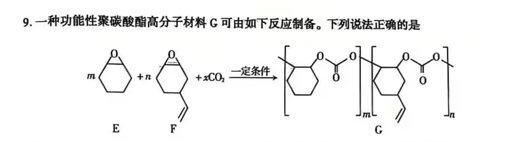
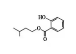
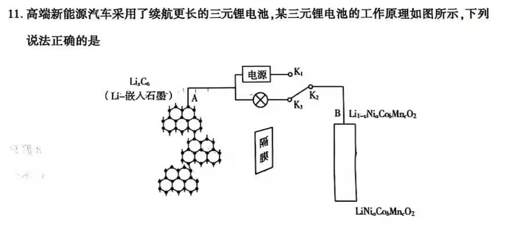
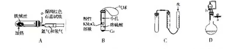
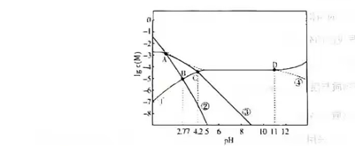

7. 化学与生活密切相关。下列说法正确的是

A. 盐卤是制作豆腐常用的凝固剂，能使豆浆中的蛋白质变性  
B. 霍尔推力器的放电腔体采用的氮化硼陶瓷基复合材料属于新型无机非金属材料  
C. 面包师用小苏打作发泡剂烘焙面包是因为 $\text{Na}_2\text{CO}_3$ 可与酸反应  
D. 燃煤中加入 $\text{CaO}$ 可以减少酸雨的形成及温室气体的排放  

8. 下列离子方程式错误的是

A. 将过量 $\text{SO}_2$ 通入 $\text{NaClO}$ 溶液中：$\text{SO}_2 + \text{H}_2\text{O} + \text{ClO}^- = 2\text{H}^+ + \text{Cl}^- + \text{SO}_4^{2-}$  
B. 向 $\text{Na}_2\text{S}_2\text{O}_3$ 溶液中滴加稀硫酸：$2\text{H}^+ + \text{S}_2\text{O}_3^{2-} = \text{S} \downarrow + \text{SO}_2 \uparrow + \text{H}_2\text{O}$  
C. 将 $\text{CO}_2$ 通入 $\text{CaCl}_2$ 溶液中：$\text{Ca}^{2+} + \text{CO}_2 + \text{H}_2\text{O} = \text{CaCO}_3 \downarrow + 2\text{H}^+$  
D. 将少量 $\text{Cl}_2$ 通入 $\text{FeI}_2$ 溶液中：$2\text{I}^- + \text{Cl}_2 = 2\text{Cl}^- + \text{I}_2$  

9. 一种功能性聚碳酸酯高分子材料G可由如下反应制备。下列说法正确的是

A. 参加反应的E、F、$\text{CO}_2$的物质的量之比为 $m:n:(m+n)$  
B. E、F均能使溴的四氯化碳溶液褪色  
C. 所含元素的第一电离能：$\text{O} > \text{C} > \text{H}$  
D. E与F均含有2个手性碳原子  

10.  水杨酸异戊酯的结构简式如图所示。下列说法错误的是

A. 水杨酸异戊酯的分子式为 $\text{C}_{12}\text{H}_{16}\text{O}_3$  
B. 该物质能形成分子内氢键  
C. $1 \, \text{mol}$ 该物质与溴水反应最多消耗 $3 \, \text{mol} \, \text{Br}_2$  
D. $1 \, \text{mol}$ 该物质最多消耗 $2 \, \text{mol} \, \text{NaOH}$  

11. 高端新能源汽车采用了续航更长的三元锂电池，其三元锂电池的工作原理如图所示，下列说法正确的是

A. 放电时，电流从B极流向A极，再通过电解液流入B极  
B. 充电时，A极发生的反应为 $\text{Li}_x\text{C}_6 + x\text{e}^- = x\text{Li}^+ + 6\text{C}$  
C. 充电时，需连接 $\text{K}_1$、$\text{K}_2$，B极发生的反应为 $\text{Li}_{1-x}\text{Ni}_a\text{Co}_b\text{Mn}_c\text{O}_2 + x\text{Li}^+ + x\text{e}^- = \text{LiNi}_a\text{Co}_b\text{Mn}_c\text{O}_2$  
D. 放电时，每转移 $x \, \text{mol}$ 电子，B极质量减少 $7x \, \text{g}$ 

12. 下列化学实验目的与相应实验示意图不相符的是

A. 模拟工业制备并检验氨气  
B. 制备 SO₂ 并验证其还原性（加热省略）  
C. 加水可检查装置的气密性  
D. 关闭 a 打开 b 检查装置气密性  

13. 常温下，往足量草酸钙固体与水的混合体系中加盐酸或 NaOH 调节 pH 时，$\lg c(\text{H}_2\text{C}_2\text{O}_4)$、$\lg c(\text{HC}_2\text{O}_4^-)$、$\lg c(\text{C}_2\text{O}_4^{2-})$ 与 pH 变化关系如图所示。下列说法错误的是

A. 虚线代表 $\text{Ca}^{2+}$ 浓度的变化  
B. $K_{a1} = 10^{-1.24}$  
C. pH > 12 后，曲线①呈上升趋势的原因可能是部分 $\text{CaC}_2\text{O}_4$ 转化为 $\text{Ca(OH)}_2$  
D. pH < 7，$c(\text{HC}_2\text{O}_4^-) + 2c(\text{C}_2\text{O}_4^{2-}) > 2c(\text{Ca}^{2+})$