7. 化学助推科技发展。下列科技成果应用中不涉及化学变化的是
   
    A. 废弃油脂脱氧获取烃类燃料
   
    B. 用 $CO_2$ 跨临界制冷技术制冰
    
    C. 降解聚乳酸废料
    
    D. 用 La-Ni 合金储氢

8. 下列工业生产中相关反应式正确的是
    
    A. 电解法冶炼铝：$2Al_2O_3 \xrightarrow{电解} 4Al + 3O_2 \uparrow$
   
    B. “海水提镁”中用石灰乳沉镁：$Mg^{2+} + 2OH^- = Mg(OH)_2 \downarrow$
    
    C. 焦炭还原石英砂制得粗硅：$SiO_2 + 2C \xrightarrow{高温} Si + 2CO \uparrow$
   
    D. 电解精炼粗铜阴极电极反应式：$Cu^{2+} + 2e^- = Cu$

9. 聚丙烯酰胺 (PAM) 是人形机器人电子皮肤常用的柔性基底材料，可用如下反应制备。
    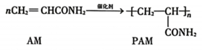
    下列说法错误的是
    
    A. 该反应属于加聚反应
   
    B. AM 中碳原子均发生 $sp^2$ 杂化
    
    C. AM 分子中 $\sigma$ 键与 $\pi$ 键个数之比为 9:1
   
    D. PAM 在酸或碱存在并加热的条件下可以发生水解反应

10. 下列实验装置不能达到实验目的的是
    
    | A | B | C | D |
    | :---: | :---: | :---: | :---: |
    | 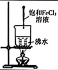 | 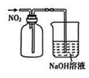 | 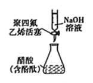 | 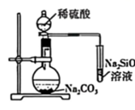 |
    | 制备 $Fe(OH)_3$ 胶体 | 收集气体 | 测定醋酸溶液的浓度 | 证明元素非金属性：$S>C>Si$ |

11. 一种配位化合物分子结构如图所示，其中 W、X、Y、Z 是原子序数依次增大的短周期元素，X、Y、Z 同周期且次外层有 2 个电子。下列说法正确的是
    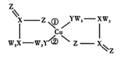
    
    A. 原子半径：$Y>Z>W$
   
    B. 第一电离能：$Z>Y>X$
   
    C. 配位键的稳定性：①>②
   
    D. 简单氢化物的键角：$Z>Y>X$

12. 一种电催化制备尿素 $CO(NH_2)_2$ 的装置示意图如图所示。下列说法错误的是
    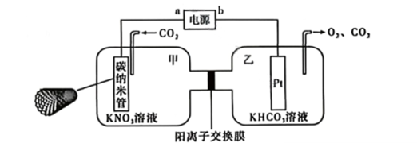
   
    A. 碳纳米管是一种新型无机非金属材料
   
    B. 乙池中 $K^+$ 通过阳离子交换膜移向甲池
   
    C. 阳极区发生的总反应式：$N_2 + 6H_2O - 10e^- = 2NO_3^- + 12H^+$
   
    D. 理论上，碳纳米管电极上消耗 $11.2L \ N_2$ (标准状况)，电路中转移电子数为 $5N_A$ ($N_A$ 表示阿伏加德罗常数的值)

13. 室温下，向 $K_2Cr_2O_7$ 溶液中加入少量 $KOH$ 固体，溶液中铬元素以 $CrO_4^{2-}$、$HCrO_4^-$、$Cr_2O_7^{2-}$ 形式存在，保持溶液体积不变，$M$ 包括含铬各组分及 $OH^-$ 随 pH 变化如图。
    已知：$K_{sp}[BaCrO_4] = 1.2 \times 10^{-10}$。下列说法正确的是
    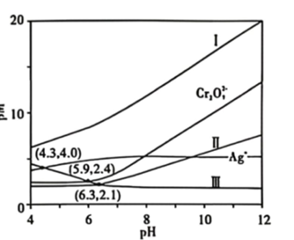
    
    A. 曲线 $L_1$ 代表 $Cr_2O_7^{2-}$
    
    B. pH=5.9 时，$c(CrO_4^{2-}) = c(HCrO_4^-)$
   
    C. pH=6.3 时，$c(H_2CrO_4) = (0.1 - 2c(Cr_2O_7^{2-}) - c(HCrO_4^-)) \text{mol/L}$
    
    D. 任意 pH 下均有 $c(K^+) + c(H^+) = c(OH^-) + c(HCrO_4^-) + 2c(CrO_4^{2-}) + 2c(Cr_2O_7^{2-})$

26. (14 分) 我国每年回收约 120 万吨废食用大豆油，如何利用废大豆油实现资源再利用，是亟待解决的问题。本实验采用废食用大豆油作为原料，利用微乳法制备纳米氧化锌催化剂。实验步骤如下：
    
    **Ⅰ. 皂化反应制备乳化剂：**
    将大豆油、NaOH、去离子水与无水乙醇加入三颈烧瓶中，混合搅拌，保持 75℃，进行皂化反应 30min。将反应后所得液体倒入饱和食盐水中静置 10min 左右，得到淡黄色均匀粘稠的膏状乳化剂。
   
    **Ⅱ. 微乳法制备纳米氧化锌 (见下，部分条件略)：**
    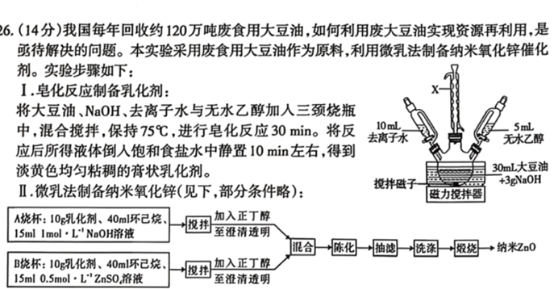
   
    **Ⅲ. 测定产品中氧化锌含量：**
    将实验获得的 0.51g 氧化锌产品置于烧杯中加酸溶解，加入 2 滴二甲酚橙指示剂和六亚甲基四胺溶液，溶液呈现稳定的紫红色，将该溶液等分为 3 份，每份都用 $0.0500 \text{mol/L} \ Na_2EDTA$ 标准溶液滴定至溶液由紫红色刚好变为亮黄色，发生 $Zn^{2+} + H_2Y^{2-} = ZnY^{2-} + 2H^+$ (简化表示)，3 次滴定平均消耗 $Na_2EDTA$ 标准溶液 20.00mL。
    回答下列问题：
    
    (1) 仪器 X 的名称为 \_\_\_\_\_\_。
    
    (2) 假设大豆油中的油脂为油酸甘油酯，在“步骤Ⅰ”中皂化反应的产物为 \_\_\_\_\_\_、\_\_\_\_\_\_。
    
    (3) “步骤Ⅰ”将反应后所得液体倒入饱和食盐水中静置的目的是 \_\_\_\_\_\_。
    
    (4) “步骤Ⅰ”中无水乙醇的作用为 \_\_\_\_\_\_，在“步骤Ⅱ”中 \_\_\_\_\_\_ (填“环己烷”“正丁醇”) 也起相同作用。
    
    (5) “步骤Ⅱ”中依次用去离子水和无水乙醇洗涤滤渣，检验滤渣已洗涤干净的方法是 \_\_\_\_\_\_。
    
    (6) “步骤Ⅲ”中测定氧化锌纯度为 \_\_\_\_\_\_；若滴定前滴定管尖嘴处有气泡，滴定后尖嘴处无气泡会使产品纯度的测定 \_\_\_\_\_\_ (填“偏大”“偏小”或“无影响”)。

27. (15 分) 新疆硒、碲元素储量丰富，常以伴生矿存在。某铜冶炼厂产生大量阳极泥 (主要成分为 $Cu_2S$、$Cu_2Se$、$Cu_2Te$ 和少量金属单质 Pt、Au 等)，从该阳极泥中回收硒、碲工艺流程如下：
    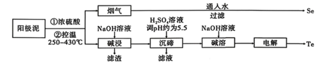
    
    已知：①$TeO_2$ 是两性氧化物；+4 价 Te 性质稳定，在碱性溶液中常以 $TeO_3^{2-}$ 的形式存在；②$SeO_2$ 和 $TeO_2$ 的部分性质如表：
    | 物质 | 熔点 | 沸点 | 水溶性 |
    | :--- | :--- | :--- | :--- |
    | $SeO_2$ | 340℃ (升华) | 684℃ | 易溶于水，生成 $H_2SeO_3$ |
    | $TeO_2$ | 733℃ (升华) | 1260℃ | 难溶于水 |
    
    (1) Se 位于第四周期第ⅥA 族，基态 Se 原子价层电子排布式为 \_\_\_\_\_\_。
    
    (2) “烟气”的主要成分是 \_\_\_\_\_\_ (填化学式，下同)；“滤渣”中含有的金属单质是 \_\_\_\_\_\_；在实验室中“过滤”操作要用到的玻璃仪器有漏斗、玻璃棒、\_\_\_\_\_\_。
    
    (3) “沉碲”时得到 $TeO_2$ 加 $H_2SO_4$ 溶液调 pH 约为 5.5 的原因是 \_\_\_\_\_\_。
    
    (4) “碱溶”的浸出率随 NaOH 溶液浓度、反应温度变化的曲线如图所示，由图可知“碱溶”时最佳条件为 \_\_\_\_\_\_ ℃、\_\_\_\_\_\_ $g \cdot L^{-1}$。
    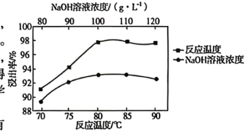
    
    (5) 电解“碱溶”所得溶液可制得单质 Te，则电解时阴极电极反应式为 \_\_\_\_\_\_。若将 $TeO_3^{2-}$ 先溶于盐酸得到 $H_2TeO_3$ 溶液，然后将 $SO_2$ 通入到 $H_2TeO_3$ 溶液中也能得到单质 Te，由 $H_2TeO_3$ 得到单质 Te 的化学方程式为 \_\_\_\_\_\_。
    
    (6) 上述流程中可以循环利用的物质有 NaOH 和 \_\_\_\_\_\_ (填化学式)。

28. (14 分) 百余年来，合成氨从实验室走向工业生产，技术持续发展完善。回答下列问题：
   
    **Ⅰ. 1905 年，弗兰克研发了使用碳化钙合成氨的方法：**
    $CaC_2 + N_2 \xrightarrow{1100^\circ C} CaNCN + C \quad \Delta H = -290.4 \text{kJ} \cdot \text{mol}^{-1}$
    
    (1) 计算反应：$CaNCN + 3H_2O = CaCO_3 + 2NH_3$ 的 $\Delta H =$ \_\_\_\_\_\_ $\text{kJ} \cdot \text{mol}^{-1}$。
    已知：$CaC_2(s) + 2H_2O(l) = Ca(OH)_2(s) + C_2H_2(g) \quad \Delta H = -128.0 \text{kJ} \cdot \text{mol}^{-1}$
    $Ca(OH)_2(s) + CO_2(g) = CaCO_3(s) + H_2O(l) \quad \Delta H = -109.5 \text{kJ} \cdot \text{mol}^{-1}$
    $C_2H_2(g)$ 的电子式：\_\_\_\_\_\_。$CaC_2$ 的晶胞结构与 NaCl 的相似 (如图 1 所示)，但 $CaC_2$ 晶体中哑铃形 $C_2^{2-}$ 的存在，使晶胞沿一个方向拉长，$CaC_2$ 晶体中每个 $Ca^{2+}$ 周围等距且紧邻的 $C_2^{2-}$ 有 \_\_\_\_\_\_ 个。
    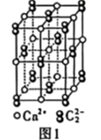
   
    **Ⅱ. 1913 年，哈伯 - 博施研发的催化合成氨技术：** $N_2(g) + 3H_2(g) \rightleftharpoons 2NH_3(g)$，实现氨大规模工业化生产。
    
    (1) 已知在容积为 $V \text{L}$ 的恒温密闭容器中，充入 $N_2$ 和 $H_2$ 的总物质的量为 $1 \text{mol}$，容器内各组分的物质的量分数与反应时间 $t$ 的关系如图 2 所示：
    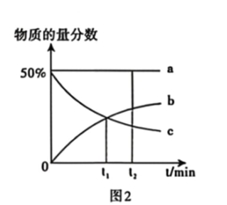
    ①表示 $N_2$ 物质的量分数变化的曲线是 \_\_\_\_\_\_ (填"a""b"或"c")。
    
    (2) 按体积比 1:3 充入 $N_2$ 和 $H_2$ 发生反应，平衡时反应混合物中氨的含量 (体积分数) 随温度和压强的变化情况如图 3 所示：
    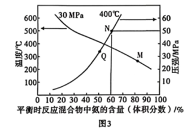
   
    ①M、N、Q 三点对应的平衡常数 $K_M$、$K_N$、$K_Q$ 由大到小的顺序为 \_\_\_\_\_\_；
   
    ②N 点对应的压强平衡常数 $K_p =$ \_\_\_\_\_\_ (保留两位有效数字)。(分压=总压×物质的量分数)
   
    **Ⅲ. 2020 年，中国科学家张礼知教授团队研发出双催化剂双温合成氨技术，解决了温度对合成氨反应速率和平衡转化率影响矛盾的问题。其催化合成氨机理如图 4 所示。**
    双催化剂双温合成氨可获得更高产率的原因是 \_\_\_\_\_\_。
    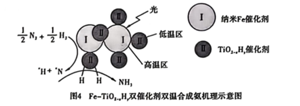

29. (15 分) 脱落酸是调控植物抗逆性的核心激素，其人工合成兼具理论与应用价值。脱落酸的合成路线如下：
    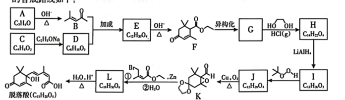
    已知：
    
    1. 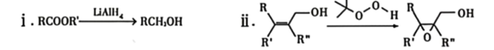
   
    2. 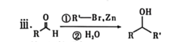
    
    回答下列问题：
    
    (1) A 的红外光谱中最显著的特征峰是羰基 $C=O$ 的伸缩振动吸收峰；A 不能被银氨溶液、新制的 $Cu(OH)_2$ 氧化。A 的名称为 \_\_\_\_\_\_。
   
    (2) $G \to H$ 的目的是 \_\_\_\_\_\_。
   
    (3) $J \to K$ 实现了由 \_\_\_\_\_\_ 到 \_\_\_\_\_\_ 的转化 (填官能团名称)，该反应的化学方程式是 \_\_\_\_\_\_。
   
    (4) $K \to L$ 过程中，还存在 L 生成 Y 和乙醇的副反应。已知 Y 中包含 2 个六元环，Y 不能与 Na 反应置换出 $H_2$。若不分离副产物 Y，是否会明显降低脱落酸的纯度，判断并说明理由 \_\_\_\_\_\_。
   
    (5) 下列有关脱落酸的说法不正确的是 \_\_\_\_\_\_ (填标号)。
       
        A. 存在 1 个手性碳原子
        
        B. 所有碳原子处于同一平面内
        
        C. 能发生取代、加成、氧化反应
       
        D. 1mol 脱落酸与足量金属钠反应可得到 $1mol \ H_2$
   
    (6) 写出符合下列条件 B 的同分异构体的结构简式为 \_\_\_\_\_\_。
       
        ①有且只有一个环 ②仅含一种官能团 ③核磁共振氢谱显示有两组峰，峰面积比为 3:2
    
    (7) 参照反应: 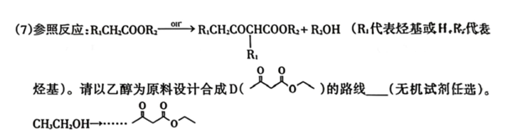 ($R_1$ 代表烃基或 H，$R_2$ 代表烃基)。请以乙醇为原料设计合成 $CH_3CH_2CH_2COCH_2COOCH_2CH_3$ 的路线 \_\_\_\_\_\_ (无机试剂任选)。
    $CH_3CH_2OH \to \dots \to$ 目标产物。
