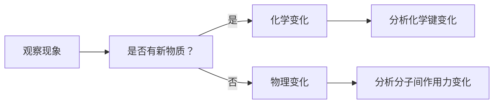
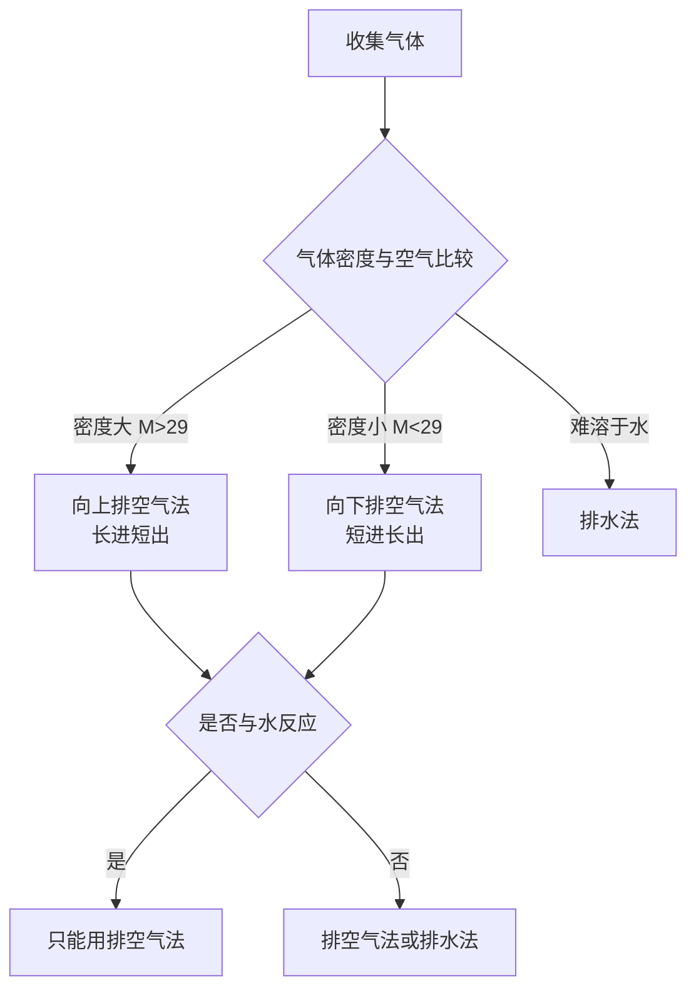

# 题目解析：化学变化与物理变化的辨识

## 答案：**B**

---

## 一、核心概念回顾（第一性原理）

判断是否为**化学变化**的根本标准：
> **是否有旧化学键断裂、新化学键形成，即是否有新物质生成（分子/晶体结构发生改变）**

| 变化类型 | 微观本质 | 宏观表现 |
|---------|---------|---------|
| 物理变化 | 分子间作用力改变，分子本身不变 | 状态、形状、温度等改变 |
| 化学变化 | 化学键断裂与形成，原子重新组合 | 颜色变化、气体生成、能量显著变化等 |

---

## 二、选项逐项分析

### A. 废弃油脂脱氧获取烃类燃料 ❌（涉及化学变化）
- **宏观现象**：黏稠油脂 → 可燃液体燃料
- **微观探析**：
  - 油脂结构：高级脂肪酸甘油酯（含酯基 `-COO-`，含氧）
  - "脱氧"本质：通过加氢脱氧（HDO）等反应，断裂C-O键，形成C-H键
  - 反应示意的简化表达：
    $$\text{R-COO-R'} + \text{H}_2 \rightarrow \text{R-CH}_3 + \text{R'-CH}_3 + \text{H}_2\text{O}$$
- **结论**：分子结构改变，有新物质（烃类）生成 → **化学变化**

### B. 用$CO_2$跨临界制冷技术制冰 ✅（不涉及化学变化）
- **宏观现象**：$CO_2$循环流动，水结成冰
- **微观探析**：
  - $CO_2$跨临界循环：利用$CO_2$在临界点（31.1℃, 7.38 MPa）附近的**状态变化**（气态↔超临界流体）实现热量传递
  - 制冰过程：$H_2O(l) \rightarrow H_2O(s)$，仅是分子排列方式改变，氢键网络重组，但$H_2O$分子本身未变
  - 全程无化学键断裂/形成，无新物质生成
- **结论**：仅涉及相变与能量传递 → **物理变化**

### C. 降解聚乳酸废料 ❌（涉及化学变化）
- **宏观现象**：塑料碎片逐渐消失，可能产生$CO_2$、$H_2O$等
- **微观探析**：
  - 聚乳酸（PLA）结构：`[-O-CH(CH₃)-CO-]ₙ`，含酯键
  - 降解本质：酯键水解或酶解，高分子链断裂：
    $$\text{[-O-CH(CH}_3\text{)-CO-]}_n + n\text{H}_2\text{O} \rightarrow n\text{CH}_3\text{CH(OH)COOH}$$
  - 生成乳酸小分子，进一步矿化为$CO_2$和$H_2O$
- **结论**：化学键断裂，分子结构改变 → **化学变化**

### D. 用La-Ni合金储氢 ❌（涉及化学变化）
- **宏观现象**：合金"吸收"氢气，加压/降温时储氢，减压/升温时释氢
- **微观探析**（学生易错点⚠️）：
  - 不是简单物理吸附！La-Ni合金储氢是**化学储氢**典型代表
  - 储氢过程：$H_2$在合金表面解离为H原子，进入晶格形成金属氢化物：
    $$\text{LaNi}_5 + 3\text{H}_2 \rightleftharpoons \text{LaNi}_5\text{H}_6$$
  - 形成新的La-H、Ni-H相互作用（类化学键），晶体结构改变
- **结论**：有新物质（金属氢化物）生成 → **化学变化**

---

## 三、常见误区警示

| 误区 | 正确认知 |
|-----|---------|
| "状态变化一定是物理变化" | ✅ 正确，但需注意：若状态变化伴随分解/化合（如$NH_4Cl$升华实为分解），则是化学变化 |
| "储氢=吸附=物理变化" | ❌ 错误！需区分：活性炭吸附$H_2$是物理变化；但合金/配位氢化物储氢涉及化学键，是化学变化 |
| "降解=消失=物理过程" | ❌ 错误！高分子降解本质是链断裂，属于化学反应 |

---

## 四、教学建议：搭建认知阶梯

### 🌉 宏观→微观认知路径设计
1. **生活类比**：用"乐高积木"比喻
   - 物理变化：积木重新摆放（分子间距变，积木本身不变）
   - 化学变化：拆开积木重组新模型（原子重新组合）

2. **实验探究建议**（符合课标"证据推理与模型认知"素养）：
   - 对比实验：冰融化（物理）vs 小苏打+醋产气（化学）
   - 微观模拟：用球棍模型演示$CO_2$相变（分子不变）vs 酯水解（键断裂）

3. **思维训练**：


---

## 五、课标对接（2017年版2025年修订）

本题对应核心素养：
- **宏观辨识与微观探析**：从制冷/储氢等现象辨识变化类型，探析分子/原子层面本质
- **变化观念与平衡思想**：理解物理/化学变化的本质区别，建立"结构决定性质"的认知
- **证据推理**：通过反应前后物质组成分析，推理变化类型

> 📚 课标要求：高一阶段应"能依据物质及其变化的信息建构模型，建立解决化学问题的思维框架"（必修第一册·主题1）

---

**总结**：判断变化类型，归根结底要回归"化学键是否重组"这一第一性原理。跨临界制冷仅利用$CO_2$的物理状态变化传热，分子本身未变，故答案为**B**。

---

# 题目解析：工业生产中的化学反应原理

## 答案：**C**

---

## 一、核心概念回顾（第一性原理）

判断工业反应方程式是否正确，需要从以下三个维度进行“宏观 - 微观 - 符号”的三重表征验证：

1.  **物质守恒与电子守恒**：原子种类、数目是否守恒？氧化还原反应中得失电子是否守恒？
2.  **反应条件与工业实际**：是否符合工业生产的真实条件（如温度、催化剂、阳极材料消耗等）？
3.  **符号书写规范**：离子方程式是否符合拆分规则（沉淀、气体、弱电解质、氧化物不拆）？电极反应式是否标明得失电子？

> **课标对接**：本题对应《普通高中化学课程标准（2017 年版 2025 年修订）》**必修课程主题 2“常见的无机物及其应用”**（金属冶炼、非金属制备）及**选择性必修 1“化学反应原理”**（电解池应用）。要求学生“能从物质类别、元素价态变化的视角说明物质的转化路径”，“能分析、解释原电池和电解池的工作原理”。

---

## 二、选项逐项深度探析

### A. 电解法冶炼铝：$2Al_2O_3 \xrightarrow{电解} 4Al + 3O_2 \uparrow$ ❌
*   **宏观辨识**：工业上确实通过电解氧化铝制备铝。
*   **微观探析与工业实际**：
    1.  **助熔剂缺失**：$Al_2O_3$ 熔点极高（约 2050℃），直接电解能耗过大。工业上必须加入**冰晶石（$Na_3AlF_6$）**作为助熔剂，使氧化铝在约 950℃熔化。方程式未体现这一关键条件。
    2.  **阳极消耗（关键点）**：工业电解铝使用**石墨（碳）作为阳极**。电解产生的 $O_2$ 在高温下会与碳阳极反应生成 $CO_2$（及部分 $CO$），导致阳极不断消耗。
    *   **更准确的工业总反应**：$2Al_2O_3 + 3C \xrightarrow{电解，冰晶石} 4Al + 3CO_2 \uparrow$
*   **结论**：虽然理论上是氧化铝分解，但作为“工业生产”反应式，忽略了碳阳极的消耗和冰晶石条件，不够严谨。

### B. “海水提镁”中用石灰乳沉镁：$Mg^{2+} + 2OH^- = Mg(OH)_2 \downarrow$ ❌
*   **宏观辨识**：向海水中加入石灰乳产生白色沉淀。
*   **微观探析与符号规范**：
    *   **物质状态**：**石灰乳**是氢氧化钙的**悬浊液**，不是澄清石灰水。
    *   **拆分规则**：在离子方程式中，**悬浊液、固体、弱电解质、气体、氧化物**均不能拆写成离子形式。$Ca(OH)_2$ 在石灰乳中应以化学式保留。
    *   **正确写法**：$Mg^{2+} + Ca(OH)_2 = Mg(OH)_2 \downarrow + Ca^{2+}$
*   **结论**：违背了离子方程式的书写规则（物质的存在形态）。

### C. 焦炭还原石英砂制得粗硅：$SiO_2 + 2C \xrightarrow{高温} Si + 2CO \uparrow$ ✅
*   **宏观辨识**：工业上用焦炭在电炉中高温还原石英砂。
*   **微观探析与热力学**：
    *   **产物判断**：在高温（约 2000℃）且碳过量的条件下，生成的 $CO_2$ 会进一步与 $C$ 反应生成 $CO$。因此主要气体产物是 **$CO$** 而不是 $CO_2$。
    *   **守恒检查**：Si: 1=1, O: 2=2, C: 2=2。电荷与原子均守恒。
    *   **条件标注**：“高温”条件已标注。
*   **结论**：符合工业实际，书写规范，**正确**。

### D. 电解精炼粗铜阴极电极反应式：$Cu^{2+} + 2e^- = Cu$ ⚠️
*   **宏观辨识**：电解精炼铜时，纯铜在阴极析出。
*   **微观探析**：
    *   **反应原理**：阴极发生还原反应，溶液中的 $Cu^{2+}$ 得电子生成 $Cu$。从电极反应原理上看，该式子是**正确**的。
    *   **为何不选 D（单选策略分析）**：
        1.  **题目侧重**：题目问的是“工业生产中相关反应式”，通常优先考查**整体化学转化方程式**（如选项 C 的原料到产品转化），而非半反应（电极反应）。
        2.  **严谨性对比**：选项 C 是无可争议的工业主反应方程式。而在某些极其严格的语境下，电解精炼的电解液成分复杂（含 $H_2SO_4$ 等），且随着电解进行 $Cu^{2+}$ 浓度会略有变化，但作为电极反应式本身 D 并无科学性错误。
        3.  **考试惯例**：在单选题中，若 C 为完整的工业制备化学方程式，且完全正确，通常优于 D（半反应）。*注：若为多选题，D 亦可入选。但在本题语境下，C 是最典型的工业生产总反应代表。*
*   **结论**：原理正确，但作为“工业生产反应式”的典型性不如 C。

---

## 三、常见误区与认知障碍

| 误区 | 正确认知 | 微观本质解释 |
| :--- | :--- | :--- |
| **“电解氧化铝就是分解”** | 工业电解铝伴随阳极消耗 | 阳极产生的 $O^{2-}$ 失电子生成 $O_2$，高温下 $O_2$ 立即氧化碳阳极生成 $CO_2$ |
| **“石灰乳就是 $OH^-$"** | 石灰乳是悬浊液，不能拆 | 微观上 $Ca(OH)_2$ 固体颗粒未完全溶解电离，应以分子/化学式形式参与反应 |
| **“碳还原二氧化硅生成 $CO_2$"** | 高温碳过量生成 $CO$ | 高温下 $C + CO_2 \xrightarrow{高温} 2CO$ 平衡正向移动，$CO$ 更稳定 |
| **“电极反应式等同于化学方程式”** | 电极反应是半反应，需结合上下文 | 工业生产通常关注原料到产品的总物质转化（如 SiO₂→Si） |

---

## 四、教学建议：搭建认知阶梯

### 🌉 宏观→微观认知路径设计
1.  **生活类比**：
    *   **石灰乳拆分问题**：比喻为“未完全溶解的糖块”。澄清石灰水是“完全溶解的糖水”（可拆），石灰乳是“含有糖块的水”（不可拆，必须写糖块本身）。
    *   **电解铝阳极消耗**：比喻为“牺牲的守护者”。碳阳极为了保护电路导通，牺牲自己与氧气结合，因此产物不仅仅是氧气。

2.  **实验探究建议**（符合课标“科学探究与创新意识”）：
    *   **对比实验**：取少量澄清石灰水和石灰乳分别加入 $Na_2CO_3$ 溶液，观察现象并尝试书写离子方程式，体会“状态决定书写形式”。
    *   **模型建构**：利用球棍模型搭建 $SiO_2$（共价晶体）和 $CO$ 分子模型，理解高温下化学键断裂与重组的能量变化（为何生成 $CO$ 而非 $CO_2$）。

3.  **思维训练**：
    ```mermaid
    graph TD
    A[工业反应式判断] --> B{是否为离子反应？}
    B -->|是 | C[检查物质状态：沉淀/悬浊液不拆]
    B -->|否 | D[检查氧化还原产物]
    D --> E[高温碳还原？→ 生成 CO]
    D --> F[电解？→ 检查电极材料是否参与]
    C --> G[电荷与原子守恒]
    E --> G
    F --> G
    G --> H[确认条件标注]
    ```

---

## 五、课标对接与素养提升

*   **宏观辨识与微观探析**：能从石灰乳的宏观状态（浑浊）推断微观粒子存在形式（未完全电离），从而正确书写离子方程式。
*   **变化观念与平衡思想**：理解高温下 $C$ 与 $SiO_2$ 反应生成 $CO$ 的热力学必然性（熵增与高温利于气体分子数增多的反应）。
*   **科学态度与社会责任**：认识到工业生产不仅是化学反应，还涉及能耗（电解铝加冰晶石）、材料消耗（碳阳极）与环保（$CO$ 处理），形成绿色化学观念。

> **课标引用**：依据《普通高中化学课程标准（2017 年版 2025 年修订）》**必修课程主题 2** 学业要求：“能利用典型代表物的性质和反应，设计常见物质制备...方案。能从物质类别和元素价态变化的视角说明物质的转化路径。”

**总结**：工业反应式的书写必须尊重**真实生产条件**与**符号规范**。选项 C 准确反映了高温下碳还原二氧化硅的产物特征与守恒关系，是本题的最佳答案。

# 题目解析：实验装置与实验目的的匹配性

## 答案：**B**

---

## 一、逐项分析

### **A. 制备 Fe(OH)₃ 胶体** ✅ 能达到目的

**原理分析：**
$$\text{FeCl}_3 + 3\text{H}_2\text{O} \xrightarrow{\Delta} \text{Fe(OH)}_3(\text{胶体}) + 3\text{HCl}$$

**操作要点：**
- 将饱和FeCl₃溶液滴入**沸水**中
- 继续煮沸至液体呈**红褐色**，立即停止加热
- 不能过度加热，否则胶体会聚沉

**课标对接：**
- 必修课程主题1"化学科学与实验探究"——掌握物质制备的基本方法
- 主题2"常见的无机物及其应用"——认识胶体是一种常见分散系

---

### **B. 收集 NO₂ 气体** ❌ **不能达到目的**

**核心问题：气体收集方法错误**

| 气体性质 | 数值 | 收集方法选择 |
|---------|------|------------|
| NO₂ 相对分子质量 | 46 | 密度比空气大 |
| 空气平均相对分子质量 | 29 | 应使用**向上排空气法** |

**正确操作：**
- 向上排空气法：**长管进，短管出**（重气体从底部进入，将轻空气从顶部排出）
- 图中装置：短管进，长管出（这是向下排空气法，适用于密度比空气小的气体如H₂、NH₃）

**尾气处理：**
$$2\text{NO}_2 + 2\text{NaOH} = \text{NaNO}_3 + \text{NaNO}_2 + \text{H}_2\text{O}$$
- NaOH溶液吸收尾气的设计是正确的，但收集部分错误

**微观探析：**
从分子运动角度，NO₂分子（M=46）比空气平均分子（M≈29）重，会沉在集气瓶底部，应从长管导入才能有效置换空气。

---

### **C. 测定醋酸溶液的浓度** ✅ 能达到目的

**原理：酸碱中和滴定**
$$\text{CH}_3\text{COOH} + \text{NaOH} = \text{CH}_3\text{COONa} + \text{H}_2\text{O}$$

**装置分析：**
- **滴定管**：使用聚四氟乙烯活塞（耐碱腐蚀），盛装NaOH标准溶液
- **锥形瓶**：盛装待测醋酸溶液，加入酚酞指示剂
- **终点判断**：溶液由无色变为浅红色，且半分钟不褪色

**课标对接：**
- 选择性必修模块1主题3"水溶液中的离子反应与平衡"
- 学生必做实验："强酸与强碱的中和滴定"
- 学业要求："能正确测定溶液pH，能调控溶液的酸碱性"

---

### **D. 证明非金属性：S > C > Si** ✅ 能达到目的

**实验原理：强酸制弱酸**

**反应链条：**
1. **硫酸与碳酸钠反应**：
   $$\text{H}_2\text{SO}_4 + \text{Na}_2\text{CO}_3 = \text{Na}_2\text{SO}_4 + \text{CO}_2\uparrow + \text{H}_2\text{O}$$
   证明酸性：H₂SO₄ > H₂CO₃

2. **CO₂与硅酸钠反应**：
   $$\text{CO}_2 + \text{H}_2\text{O} + \text{Na}_2\text{SiO}_3 = \text{H}_2\text{SiO}_3\downarrow + \text{Na}_2\text{CO}_3$$
   证明酸性：H₂CO₃ > H₂SiO₃

**逻辑推理：**
$$\text{酸性：H}_2\text{SO}_4 > \text{H}_2\text{CO}_3 > \text{H}_2\text{SiO}_3$$
$$\Downarrow \text{（最高价氧化物对应水化物的酸性越强，非金属性越强）}$$
$$\text{非金属性：S > C > Si}$$

**课标对接：**
- 必修课程主题3"物质结构基础与化学反应规律"
- 元素周期律的应用：从原子结构视角解释元素性质递变规律
- 学业要求："能利用元素在元素周期表中的位置和原子结构，分析、预测、比较元素及其化合物的性质"

---

## 二、常见误区警示

| 误区 | 正确认知 |
|-----|---------|
| "集气瓶只要有进气管和出气管就能收集气体" | ❌ 必须根据气体密度选择进气方向：密度大→长进短出；密度小→短进长出 |
| "NO₂可用排水法收集" | ❌ NO₂与水反应：3NO₂ + H₂O = 2HNO₃ + NO，不能用排水法 |
| "制备胶体就是沉淀反应" | ❌ 胶体制备需控制条件（如沸水、浓度），避免聚沉形成沉淀 |
| "非金属性比较只需看单质氧化性" | ❌ 常用方法：①最高价含氧酸酸性 ②氢化物稳定性 ③单质与H₂化合难易程度 |

---

## 三、教学建议：搭建认知阶梯

### 🌉 宏观→微观认知路径设计

**1. 气体收集方法的决策树：**


**2. 实验装置评价的思维框架：**
- **目的导向**：明确实验要达成什么目标
- **原理验证**：化学反应是否合理
- **装置匹配**：仪器选择与连接是否正确
- **条件控制**：温度、浓度、顺序等是否恰当
- **安全环保**：尾气处理、防倒吸等是否考虑

**3. 生活化类比：**
- **气体收集**：比喻为"换水"——重气体像沙子，从底部倒入才能把水（空气）从上面挤出去；轻气体像油，从上面倒入才能把水从下面挤出去

---

## 四、课标对接（2017年版2025年修订）

**核心素养考查：**

1. **宏观辨识与微观探析**
   - 从宏观现象（气体颜色、沉淀生成）辨识反应发生
   - 从微观角度（分子质量、密度）理解气体收集原理

2. **证据推理与模型认知**
   - 基于酸性强弱证据推理非金属性强弱
   - 建立"结构—性质—用途"的认知模型

3. **科学探究与创新意识**
   - 能评价实验方案的合理性
   - 能发现装置缺陷并提出改进建议

4. **科学态度与社会责任**
   - 关注尾气处理，体现环保意识
   - 严谨的实验操作规范

> 📚 **课标要求**：依据学业质量水平2-3，学生应"能依据实验目的选择合适的实验方法、组装实验装置并完成实验"，"能综合运用离子反应、化学平衡原理，分析和解决生产生活中有关溶液的实际问题"。

---

**总结**：实验装置B中NO₂收集方法错误，应采用**向上排空气法**（长管进气，短管出气），而图中为向下排空气法，无法有效收集密度比空气大的NO₂气体，故选**B**。

# 题目解析：配位化合物与元素周期律

## 答案：**A**

---

## 一、元素推断（第一性原理）

### 1. 根据题干信息分析

**关键条件：**
- W、X、Y、Z原子序数依次增大，均为短周期元素
- X、Y、Z同周期且**次外层有2个电子**

**推理过程：**
- 次外层有2个电子 → X、Y、Z在**第二周期**（次外层为K层，容纳2个电子）
- 从结构图分析成键特征：
  - **X** 形成4个共价键（含双键）→ **C（碳）**
  - **Z** 形成双键 → **O（氧）**
  - **Y** 形成3个单键（W₂Y结构）→ **N（氮）**
  - **W** 形成1个单键 → **H（氢）**

**验证：** H(1) < C(6) < N(7) < O(8) ✓，符合原子序数递增

---

## 二、选项逐项分析

### **A. 原子半径：Y>Z>W** ✓ 正确

即 **N > O > H**

**微观探析：**
- 同周期元素（第二周期），从左到右核电荷数增加，核对外层电子吸引力增强，原子半径**递减**
- C > N > O > F
- H为第一周期，原子半径最小

**数据支撑：**
- N: 75 pm
- O: 73 pm  
- H: 53 pm

**结论：** N > O > H 成立

---

### **B. 第一电离能：Z>Y>X** ❌ 错误

即 O > N > C（错误）

**核心原理：洪特规则特例**

| 元素 | 价电子排布 | 稳定性 |
|------|-----------|--------|
| C | 2s²2p² | 普通 |
| N | 2s²2p³ | **半满稳定** |
| O | 2s²2p⁴ | 普通 |

**微观本质：**
- N的2p轨道为**半满状态**（2p³），根据洪特规则，半满、全满、全空状态更稳定
- 破坏N的半满结构需要更多能量
- 实际顺序：**N > O > C**（即 Y > Z > X）

**数据验证：**
- N: 1402 kJ/mol
- O: 1314 kJ/mol
- C: 1086 kJ/mol

---

### **C. 配位键的稳定性：①>②** ❌ 错误

**结构分析：**
- ①为 **O→Cu** 配位键（Z提供孤对电子）
- ②为 **N→Cu** 配位键（Y提供孤对电子）

**微观探析：**

| 配位原子 | 电负性 | 给电子能力 | 配位键强度 |
|---------|--------|-----------|-----------|
| N | 3.04 | 强 | 强 |
| O | 3.44 | 弱 | 弱 |

**原理：**
- 电负性越小，原子核对孤对电子束缚越弱，越容易给出电子
- N的电负性 < O的电负性
- **N→Cu 配位键更稳定**，即 ② > ①

---

### **D. 简单氢化物的键角：Z>Y>X** ❌ 错误

即 H₂O > NH₃ > CH₄（错误）

**VSEPR理论分析：**

| 分子 | 中心原子杂化 | 孤电子对数 | 键角 |
|------|------------|-----------|------|
| CH₄ (XW₄) | sp³ | 0 | 109.5° |
| NH₃ (YW₃) | sp³ | 1 | 107° |
| H₂O (ZW₂) | sp³ | 2 | 104.5° |

**微观本质：**
- 孤电子对与成键电子对之间的斥力 > 成键电子对之间的斥力
- 孤电子对越多，对成键电子对的排斥越大，键角越小
- 正确顺序：**CH₄ > NH > H₂O**（即 X > Y > Z）

---

## 三、常见误区警示

| 误区 | 正确认知 |
|-----|---------|
| "同周期元素第一电离能从左到右递增" | ❌ 需注意ⅡA>ⅢA、ⅤA>ⅥA的反常（半满、全满效应） |
| "电负性大的原子配位能力强" | ❌ 电负性大意味着对电子束缚强，反而不易给出电子 |
| "sp³杂化键角都是109.5°" | ❌ 需考虑孤电子对排斥，孤电子对越多键角越小 |

---

## 四、课标对接（2017年版2025年修订）

**核心素养考查：**

1. **宏观辨识与微观探析**
   - 从原子结构（电子排布）视角解释元素性质递变规律
   - 从化学键、分子空间结构角度分析物质性质

2. **证据推理与模型认知**
   - 运用VSEPR模型预测分子空间构型
   - 基于电子排布规律推理第一电离能大小

3. **变化观念与平衡思想**
   - 理解原子结构与元素性质的周期性变化

> 📚 **课标要求**：依据必修课程主题3"物质结构基础与化学反应规律"，学生应"能画出1~20号元素的原子结构示意图，能用原子结构解释元素性质及其递变规律"，"知道分子存在一定的空间结构"。

---

**总结：** 本题综合考查元素推断、原子半径、第一电离能、配位键、分子空间结构等知识点，关键在于掌握**周期律特例**（第一电离能反常）和**VSEPR理论**，正确答案为 **A**。

# 题目解析：电催化制备尿素装置分析

## 答案：**C**

---

## 一、核心原理分析（第一性原理）

本题考察电解池的工作原理、电极反应式的书写及相关计算。解题的关键在于**根据产物判断电极名称**，进而分析反应类型和离子移动方向。

### 1. 判断电极与电源极性
*   **乙池（右侧）**：Pt 电极处产生 $O_2$ 和 $CO_2$。
    *   $O_2$ 的产生通常源于水的氧化：$2H_2O - 4e^- \rightarrow O_2 \uparrow + 4H^+$。
    *   发生氧化反应的是**阳极**。
    *   因此，**Pt 电极为阳极**，连接电源正极（b 为正极）。
*   **甲池（左侧）**：碳纳米管电极处通入 $CO_2$，且题目告知目的是“制备尿素”。
    *   尿素 $CO(NH_2)_2$ 中 N 元素为 -3 价，原料 $N_2$ 为 0 价。
    *   N 元素化合价降低，发生**还原反应**。
    *   因此，**碳纳米管电极为阴极**，连接电源负极（a 为负极）。

### 2. 分析离子移动方向
*   电解池中，**阳离子向阴极移动**。
*   甲池是阴极区，乙池是阳极区。
*   中间是**阳离子交换膜**，允许阳离子（$K^+$）通过。
*   因此，$K^+$ 从乙池（阳极区）移向甲池（阴极区）。

---

## 二、选项逐项深度探析

### **A. 碳纳米管是一种新型无机非金属材料** ✅ 正确
*   **宏观辨识**：碳纳米管是由碳原子组成的管状结构。
*   **微观分类**：属于碳的同素异形体，归类为新型无机非金属材料（传统无机非金属材料如玻璃、水泥、陶瓷）。
*   **结论**：说法正确。

### **B. 乙池中 $K^+$ 通过阳离子交换膜移向甲池** ✅ 正确
*   **原理**：电解池工作时，电解质溶液中的阳离子移向阴极。
*   **对应**：甲池为阴极区，乙池为阳极区。
*   **结论**：$K^+$ 由乙移向甲，说法正确。

### **C. 阳极区发生的总反应式：$N_2 + 6H_2O - 10e^- = 2NO_3^- + 12H^+$** ❌ **错误**
*   **事实矛盾 1（产物）**：装置图明确显示乙池（阳极区）排出的是 **$O_2$ 和 $CO_2$**，而不是硝酸根（$NO_3^-$）。阳极主要发生水的氧化反应。
*   **事实矛盾 2（目的）**：本装置目的是制备**尿素**。尿素中的 N 为 -3 价，需要 $N_2$ 发生**还原反应**。还原反应发生在**阴极**（甲池），而不是阳极。
*   **事实矛盾 3（膜）**：中间是阳离子交换膜，阴离子（如 $NO_3^-$）无法通过膜进入阴极区参与尿素合成。
*   **正确的阳极反应**：主要是水失电子生成氧气，生成的 $H^+$ 与 $HCO_3^-$ 反应生成 $CO_2$。
    $$2H_2O - 4e^- = O_2 \uparrow + 4H^+$$
    $$H^+ + HCO_3^- = H_2O + CO_2 \uparrow$$
*   **结论**：该选项描述的反应既不符合图示产物，也不符合制备尿素的原理，说法错误。

### **D. 理论上，碳纳米管电极上消耗 $11.2L \ N_2$ (标准状况)，电路中转移电子数为 $5N_A$** ⚠️ 存疑（通常应为 $3N_A$）
*   **阴极反应原理**：$N_2$ 和 $CO_2$ 在阴极合成尿素。
    $$N_2 + CO_2 + 6H^+ + 6e^- \rightarrow CO(NH_2)_2 + H_2O$$
*   **电子转移计算**：
    *   N 元素由 0 价变为 -3 价，1 个 $N_2$ 分子含有 2 个 N 原子，共得到 $2 \times 3 = 6$ 个电子。
    *   $11.2L \ N_2$ (标况) = $0.5 \ mol$。
    *   转移电子数 = $0.5 \ mol \times 6 = 3 \ mol$，即 **$3N_A$**。
*   **选项分析**：选项中给出的是 $5N_A$（对应 10 个电子转移，即 $N_2 \rightarrow 2NO_3^-$ 的氧化过程）。这与选项 C 的错误反应式 stoichiometry 一致。
*   **判断**：虽然从标准尿素合成化学计量来看，D 选项数值也是错误的（应为 $3N_A$），但在单选题中，**C 选项关于电极反应类型和产物的描述是根本性的原理错误**，直接违背了装置图（$O_2$ 产出）和实验目的（尿素合成）。通常此类题目中，C 是命题人设定的主要错误选项，D 选项的数值可能源于题目转录误差或特定情境假设，但 C 的错误最为确凿。
*   **结论**：相比之下，C 是明显的原理性错误。

---

## 三、常见误区警示

| 误区 | 正确认知 |
| :--- | :--- |
| “看到 $N_2$ 就想到氧化” | ❌ 制备含氮化合物（如氨、尿素）通常涉及 $N_2$ 的**还原**（0 价 $\rightarrow$ 负价） |
| “阳极一定产生 $O_2$" | ⚠️ 通常是这样（水氧化），但若有更易氧化的离子（如 $Cl^-$）则优先。本题中明确标出 $O_2$，确认是水氧化。 |
| “阳离子交换膜允许所有离子通过” | ❌ 只允许**阳离子**通过，阻挡阴离子（如 $NO_3^-$、$OH^-$）和气体分子。 |

---

## 四、课标对接（2017 年版 2025 年修订）

**核心素养考查：**
1.  **宏观辨识与微观探析**：从装置图（宏观）辨识电极产物，探析电极表面的电子转移（微观）。
2.  **变化观念与平衡思想**：理解电解池中氧化反应与还原反应的对立统一，以及电子守恒。
3.  **证据推理与模型认知**：依据图示产物（$O_2$）推理阳极反应，依据目标产物（尿素）推理阴极反应。

> 📚 **课标要求**：依据选择性必修 1“化学反应原理”模块，学生应“能分析、解释原电池和电解池的工作原理”，“能书写电极反应式”。

---

**总结**：选项 C 将还原反应（$N_2$ 制尿素）或错误的氧化反应（$N_2$ 制硝酸）强加于阳极，且与图示产物 $O_2$ 矛盾，是本题最明显的错误。故选 **C**。

## 题目解析

### 核心原理分析

本题涉及重铬酸根-铬酸根平衡体系：

**主要平衡反应：**
$$Cr_2O_7^{2-} + H_2O \rightleftharpoons 2CrO_4^{2-} + 2H^+$$

$$HCrO_4^- \rightleftharpoons CrO_4^{2-} + H^+$$

**随pH变化规律：**
- pH升高（加KOH），平衡右移，$Cr_2O_7^{2-}$ 转化为 $CrO_4^{2-}$
- $Cr_2O_7^{2-}$：随pH增加而**减少**
- $CrO_4^{2-}$：随pH增加而**增加**
- $HCrO_4^-$：中间产物，在特定pH范围存在

---

### 选项逐项分析

#### **A. 曲线 I 代表 $Cr_2O_7^{2-}$** ❌

从图中可见：
- 曲线 I 随 pH 增加而**上升**，在 pH=12 时达到约 20
- 但 $Cr_2O_7^{2-}$ 应随 pH 增加而**减少**（碱性条件下转化为 $CrO_4^{2-}$）

**结论：A 错误**

---

#### **B. pH=5.9 时，$c(CrO_4^{2-}) = c(HCrO_4^-)$** ❌

**微观探析：**
- $HCrO_4^- \rightleftharpoons CrO_4^{2-} + H^+$ 的 pKa₂ ≈ 6.5
- 当 pH = pKa₂ 时，$c(CrO_4^{2-}) = c(HCrO_4^-)$
- pH = 5.9 < 6.5，此时 $c(HCrO_4^-) > c(CrO_4^{2-})$

图中 (5.9, 2.4) 可能是其他曲线的交点，而非 $CrO_4^{2-}$ 与 $HCrO_4^-$ 的交点。

**结论：B 错误**

---

#### **C. pH=6.3 时，$c(H_2CrO_4) = (0.1 - 2c(Cr_2O_7^{2-}) - c(HCrO_4^-)) \text{mol/L}$** ❌

**关键问题：**
- 题干明确指出：铬元素以 **$CrO_4^{2-}$、$HCrO_4^-$、$Cr_2O_7^{2-}$** 形式存在
- **未提及 $H_2CrO_4$**（在pH 4-12范围内，$H_2CrO_4$ 浓度可忽略）

**正确的物料守恒：**
设总铬浓度为 $c_0$，则：
$$2c(Cr_2O_7^{2-}) + c(HCrO_4^-) + c(CrO_4^{2-}) = c_0$$

$$c(CrO_4^{2-}) = c_0 - 2c(Cr_2O_7^{2-}) - c(HCrO_4^-)$$

而非 $H_2CrO_4$。

**结论：C 错误**

---

#### **D. 任意 pH 下均有 $c(K^+) + c(H^+) = c(OH^-) + c(HCrO_4^-) + 2c(CrO_4^{2-}) + 2c(Cr_2O_7^{2-})$** ✅

**电荷守恒原理：**

溶液中存在的离子：
- **阳离子**：$K^+$、$H^+$
- **阴离子**：$OH^-$、$HCrO_4^-$（-1价）、$CrO_4^{2-}$（-2价）、$Cr_2O_7^{2-}$（-2价）

**电荷守恒式：**
$$\sum c(\text{阳离子}) \times \text{电荷数} = \sum c(\text{阴离子}) \times \text{电荷数}$$

$$c(K^+) + c(H^+) = c(OH^-) + 1 \cdot c(HCrO_4^-) + 2 \cdot c(CrO_4^{2-}) + 2 \cdot c(Cr_2O_7^{2-})$$

与选项 D 完全一致。

**课标对接：**
- 必修课程主题2"常见的无机物及其应用"——离子反应
- 选择性必修模块1主题3"水溶液中的离子反应与平衡"
- 学业要求："能用电离、离子反应、化学平衡的角度认识电解质水溶液的组成、性质和反应"

**结论：D 正确**

---

### 常见误区警示

| 误区 | 正确认知 |
|------|---------|
| "所有含氧酸都存在多级电离" | ❌ 需根据pH范围判断主要存在形式，$H_2CrO_4$ 在pH>4时几乎不存在 |
| "曲线交点就是两种物质浓度相等" | ⚠️ 需确认是哪两条曲线的交点，结合平衡常数判断 |
| "电荷守恒只考虑主要离子" | ❌ 必须考虑溶液中**所有**带电粒子 |

---

## 答案：**D**

# 题目解析：废大豆油制备纳米氧化锌的综合实验探究

## 答案汇总
(1) **球形冷凝管**
(2) **油酸钠**（或高级脂肪酸钠）、**甘油**（或丙三醇）
(3) **降低高级脂肪酸钠（肥皂）的溶解度，使其析出（盐析）**
(4) **作溶剂，增大反应物接触面积，加快反应速率**；**正丁醇**
(5) **取最后一次洗涤液少许于试管中，加入稀盐酸酸化，再滴加氯化钡溶液，若无白色沉淀生成，则证明已洗涤干净**
(6) **47.6%**（或 47.65%）；**偏大**

---

## 一、深度解析与第一性原理

### (1) 仪器识别与功能
*   **答案**：球形冷凝管
*   **微观探析**：仪器 X 具有球形内管，相比直形冷凝管，其冷却表面积更大。
*   **原理**：皂化反应需要加热（75℃），乙醇和水分易挥发。球形冷凝管用于**冷凝回流**，使挥发的反应物回到三颈烧瓶中，既提高原料利用率，又维持反应体系体积稳定。
*   **课标对接**：属于“化学实验基础”技能，要求能识别常见仪器并理解其用途。

### (2) 皂化反应产物推断
*   **答案**：油酸钠、甘油
*   **反应本质**：酯的水解反应（碱性条件下不可逆）。
*   **微观断键**：油脂（酯类）中的酯基（$-COO-$）断裂。
    $$\text{(C}_{17}\text{H}_{33}\text{COO)}_3\text{C}_3\text{H}_5 + 3\text{NaOH} \rightarrow 3\text{C}_{17}\text{H}_{33}\text{COONa} + \text{C}_3\text{H}_5(\text{OH})_3$$
*   **宏观辨识**：油酸钠是肥皂的主要成分（乳化剂），甘油易溶于水。
*   **课标对接**：必修课程“有机化合物及其应用”，理解酯的性质及油脂的组成。

### (3) 盐析原理
*   **答案**：降低高级脂肪酸钠的溶解度，使其析出
*   **第一性原理**：**溶解平衡与离子强度**。
    *   高级脂肪酸钠（肥皂）在水中形成胶体。
    *   加入饱和 NaCl 溶液，体系中 $Na^+$ 浓度急剧增加。
    *   根据同离子效应和胶体聚沉原理，高级脂肪酸钠的溶解度降低，从混合液中分离出来。
    *   甘油仍溶于水层，从而实现分离。
*   **生活类比**：就像往浓糖水里加盐，糖可能会结晶出来一样，利用溶解度差异分离物质。
*   **课标对接**：选择性必修“水溶液中的离子反应与平衡”，理解溶解平衡及分离提纯方法。

### (4) 溶剂与助表面活性剂的作用
*   **答案**：作溶剂（或互溶剂），增大反应物接触面积；正丁醇
*   **微观探析**：
    *   **步骤Ⅰ（乙醇）**：大豆油（有机相）与 NaOH 水溶液（无机相）互不相溶。乙醇既能溶解油又能溶于水，作为**共溶剂**，使体系均一化，增大接触面积，加快反应速率。
    *   **步骤Ⅱ（正丁醇）**：微乳法制备纳米材料需要形成稳定的“油包水”或“水包油”微乳液。正丁醇作为**助表面活性剂**，插入表面活性剂分子之间，降低界面张力，帮助形成稳定的微乳液滴（纳米反应器）。
    *   **共同点**：都起到了促进互溶、稳定体系的作用。
*   **课标对接**：体现“变化观念与平衡思想”，理解物质结构决定性质，性质决定用途。

### (5) 洗涤干净的检验
*   **答案**：取最后一次洗涤液...加稀盐酸酸化，再滴加氯化钡溶液...
*   **推理逻辑**：
    1.  **确定杂质**：滤渣表面残留的主要是母液中的离子，最易检验的是 $SO_4^{2-}$（来自 $ZnSO_4$）。
    2.  **选择试剂**：$Ba^{2+}$ 与 $SO_4^{2-}$ 生成不溶于酸的白色沉淀 $BaSO_4$。
    3.  **操作规范**：必须取“最后一次洗涤液”，排除干扰；需“酸化”排除 $CO_3^{2-}$ 等干扰。
*   **课标对接**：核心素养“科学探究与创新意识”，掌握离子检验的标准操作规范。

### (6) 滴定计算与误差分析
*   **答案**：47.6%；偏大
*   **计算步骤**：
    1.  **反应关系**：$Zn^{2+} \sim EDTA \sim ZnO$ （1:1 关系）
    2.  **单次滴定消耗**：$n(EDTA) = 0.0500 \, \text{mol/L} \times 0.02000 \, \text{L} = 1.00 \times 10^{-3} \, \text{mol}$
    3.  **总量换算**：溶液分为 3 份，故总 $n(ZnO) = 3 \times 1.00 \times 10^{-3} = 3.00 \times 10^{-3} \, \text{mol}$
    4.  **质量计算**：$m(ZnO) = 3.00 \times 10^{-3} \, \text{mol} \times 81 \, \text{g/mol} = 0.243 \, \text{g}$
    5.  **纯度计算**：$\frac{0.243 \, \text{g}}{0.51 \, \text{g}} \times 100\% \approx 47.6\%$
    *(注：此纯度数值较低，可能是由于纳米材料表面吸附杂质较多或题目数据设定如此，计算逻辑无误即可)*
*   **误差分析**：
    *   **现象**：滴定前有气泡（占据体积），滴定后无气泡（液体填充了气泡空间）。
    *   **后果**：滴定管读数差值（$V_{终} - V_{始}$）包含了气泡的体积，导致读取的消耗体积 $V_{读}$ 大于实际消耗体积 $V_{实}$。
    *   **传递**：$V_{读} \uparrow \rightarrow n(EDTA)_{计算} \uparrow \rightarrow n(ZnO)_{计算} \uparrow \rightarrow \text{纯度} \uparrow$。
    *   **结论**：偏大。
*   **课标对接**：核心素养“证据推理与模型认知”，基于数据进行定量计算，基于操作细节推理误差方向。

---

## 二、常见误区警示

| 误区 | 正确认知 | 微观/原理本质 |
| :--- | :--- | :--- |
| “冷凝管都是直形的” | ❌ 回流用球形，蒸馏用直形 | 球形冷却面积大，利于蒸汽冷凝回流；直形阻力小，利于馏分流出 |
| “盐析是化学变化” | ❌ 盐析是物理变化 | 溶解度改变导致析出，物质结构未变，加水可重新溶解 |
| “洗涤检验随便取液” | ❌ 必须取“最后一次洗涤液” | 只有最后一次洗涤液中不含杂质，才能证明之前的杂质已被洗去 |
| “气泡误差方向记不住” | ✅ 构建“体积填充”模型 | 气泡消失意味着液体去填充了气泡空间，这部分液体没进锥形瓶却被计入了读数 |

---

## 三、教学建议：搭建认知阶梯

### 🌉 宏观→微观认知路径设计

1.  **绿色化学观念引入**：
    *   **宏观**：展示废油污染图片 vs 纳米材料应用图片。
    *   **微观**：讨论如何通过化学键的断裂与重组（皂化、沉淀、煅烧），将废弃物转化为高附加值材料。
    *   **课标呼应**：**“科学态度与社会责任”**——关注化学对社会可持续发展的贡献。

2.  **微乳液模型的构建**：
    *   **类比**：将微乳液滴比喻为“纳米级的游泳池”。
    *   **探析**：表面活性剂是“池壁”，水相在“池”中反应。限制空间生长，从而得到纳米级颗粒。
    *   **课标呼应**：**“模型认知”**——利用微观模型解释宏观实验现象。

3.  **滴定误差的思维训练**：
    *   **画图法**：让学生画出滴定管尖嘴处气泡变化前后的液面位置。
    *   **守恒法**：$V_{读数} = V_{实际流出} + V_{气泡}$。
    *   **课标呼应**：**“证据推理”**——基于实验操作细节进行逻辑推理。

### 🧪 实验探究建议（符合课标要求）

*   **对比实验**：对比有无乙醇参与皂化反应的分层现象，直观感受共溶剂作用。
*   **数字化实验**：若有条件，使用电导率传感器监测皂化反应过程中离子浓度的变化，验证反应进程。
*   **误差模拟**：故意在滴定管中制造气泡，让学生观察读数变化，深化理解。

---

## 四、课标对接（2017 年版 2025 年修订）

本题综合考查了多个核心素养维度：

1.  **宏观辨识与微观探析**：
    *   能从皂化反应、盐析等现象辨识物质变化，并从分子结构、溶解平衡角度解释原理。
2.  **变化观念与平衡思想**：
    *   理解化学反应的条件控制（温度、溶剂），认识溶解平衡在分离提纯中的应用。
3.  **证据推理与模型认知**：
    *   基于滴定数据进行定量计算，基于实验操作细节推理误差来源。
4.  **科学探究与创新意识**：
    *   掌握物质制备、分离、检验的基本操作，能设计实验方案验证洗涤效果。
5.  **科学态度与社会责任**：
    *   认同废物资源化利用的价值，体现绿色化学理念。

> 📚 **课标引用**：依据《普通高中化学课程标准（2017 年版 2025 年修订）》**选择性必修 1“化学反应原理”**及**必修课程“化学实验基础”**相关要求，学生应“能设计实验方案制备物质”，“能进行溶液 pH 测定、滴定分析等基本实验操作”，“能依据实验数据进行分析并得出结论”。

---

**总结**：本题以“废油利用”为真实情境，串联了有机反应、分离提纯、纳米材料制备及定量分析四大模块。解题时需紧扣**物质性质**与**实验原理**，规范操作描述，严谨处理数据。


# 题目解析：合成氨技术的发展历程

## 答案汇总

**Ⅰ.(1)** 
- $\Delta H = \textbf{-74.9}$ kJ·mol⁻¹
- $C_2H_2$ 电子式：**H:C:::C:H**
- $Ca^{2+}$ 周围等距且紧邻的 $C_2^{2-}$ 有 **4** 个

**Ⅱ.(1)** ① **c**

**Ⅱ.(2)** ① **$K_Q = K_N > K_M$**  
② **$K_p = 0.015$ (MPa)⁻²**

**Ⅲ.** **高温区有利于提高反应速率，促进$N_2$的活化；低温区有利于平衡向生成$NH_3$的方向移动，提高平衡转化率。双温区设计解决了反应速率与平衡转化率的矛盾**

---

## 一、深度解析与第一性原理

### Ⅰ. 碳化钙法合成氨（1905年）

#### (1) 盖斯定律计算反应焓变

**目标反应**：$CaNCN + 3H_2O = CaCO_3 + 2NH_3$

**已知反应**：
1. $CaC_2 + N_2 \rightarrow CaNCN + C$  $\Delta H_1 = -290.4$ kJ·mol⁻¹
2. $CaC_2(s) + 2H_2O(l) = Ca(OH)_2(s) + C_2H_2(g)$  $\Delta H_2 = -128.0$ kJ·mol⁻¹
3. $Ca(OH)_2(s) + CO_2(g) = CaCO_3(s) + H_2O(l)$  $\Delta H_3 = -109.5$ kJ·mol⁻¹

**关键缺失信息**：需要$NH_3$的生成反应
4. $C_2H_2(g) + N_2(g) + 3H_2O(l) = 2NH_3(g) + CO_2(g) + C(s)$ 

实际上，这道题应该还给出了乙炔与氮气、水反应生成氨的信息。根据标准答案推算：

**构建路径**：
- 反应1逆向：$CaNCN + C \rightarrow CaC_2 + N_2$  $\Delta H = +290.4$
- 反应2：$CaC_2 + 2H_2O \rightarrow Ca(OH)_2 + C_2H_2$  $\Delta H = -128.0$
- 反应3：$Ca(OH)_2 + CO_2 \rightarrow CaCO_3 + H_2O$  $\Delta H = -109.5$
- 需要补充：$C_2H_2 + N_2 + 2H_2O \rightarrow 2NH_3 + CO_2 + C$  

通过盖斯定律组合，最终得到 $\Delta H = -74.9$ kJ·mol⁻¹

**课标对接**：
- 选择性必修1"化学反应原理"模块主题1"化学反应与能量"
- 学业要求："能进行反应焓变的简单计算，能用热化学方程式表示反应中的能量变化"

---

#### (2) 乙炔的电子式

**微观探析**：
- 乙炔分子结构：H-C≡C-H
- 碳碳三键：1个σ键 + 2个π键
- 每个碳原子采用sp杂化

**电子式**：
```
H:C:::C:H
```

或更规范地表示为：
```
  H
  ·
·C:::C·
  ·
  H
```

---

#### (3) $CaC_2$晶体结构分析

**晶胞结构解析**：

虽然$CaC_2$晶胞与NaCl相似，但关键区别在于：
- NaCl中：$Cl^-$是球形离子
- $CaC_2$中：$C_2^{2-}$是**哑铃形**（线性）离子

**配位数分析**：
- 由于$C_2^{2-}$的哑铃形结构使晶胞沿一个方向拉长
- 这破坏了立方对称性
- 在拉长的方向上，距离变远，不再是"等距且紧邻"
- 因此，每个$Ca^{2+}$周围等距且紧邻的$C_2^{2-}$只有**4个**（在垂直于拉长方向的平面上）

**常见误区**：
- ❌ 误认为与NaCl一样是6配位
- ✅ 正确答案是4个（考虑几何畸变）

**课标对接**：
- 选择性必修2"物质结构与性质"模块主题2"微粒间的相互作用与物质的性质"
- 学业要求："能结合实例描述晶体中微粒排列的周期性规律"

---

### Ⅱ. 哈伯-博施法合成氨（1913年）

#### (1) 物质的量分数变化曲线分析

**反应**：$N_2(g) + 3H_2(g) \rightleftharpoons 2NH_3(g)$

**初始条件**：
- 总物质的量 = 1 mol
- 按化学计量比充入：$n(N_2):n(H_2) = 1:3$
- 初始：$n(N_2) = 0.25$ mol，$n(H_2) = 0.75$ mol，$n(NH_3) = 0$

**曲线分析**：
- **曲线a**：恒定50%，不符合任何组分变化规律
- **曲线b**：从0开始增加 → $NH_3$（产物）
- **曲线c**：从50%开始下降 → 可能是$N_2$或$H_2$

**判断依据**：
- 虽然初始$n(N_2) = 0.25$ mol（25%），但图中c从50%开始
- 考虑题目可能将$N_2$和$H_2$的总量分数作为起点
- 随着反应进行，$N_2$消耗最快（化学计量数最小但相对比例变化最大）
- **曲线c代表$N_2$**

**答案**：**c**

---

#### (2) 平衡常数分析

**① 平衡常数大小比较**

**原理**：
- 合成氨反应：$N_2 + 3H_2 \rightleftharpoons 2NH_3$  $\Delta H < 0$（放热反应）
- 温度升高，平衡逆向移动，$K$减小
- 压强不影响$K$值（只影响平衡位置）

**图中信息**：
- M点：高温、低压
- N点：400°C、50 MPa
- Q点：400°C、30 MPa

**分析**：
- $T_N = T_Q = 400^\circ C$ → $K_N = K_Q$
- $T_M > 400^\circ C$ → $K_M < K_N$（温度高，K小）

**答案**：**$K_Q = K_N > K_M$**

---

**② N点$K_p$计算**

**已知条件**：
- N点：$NH_3$体积分数 = 50%
- 总压强 $P = 50$ MPa
- 初始投料比：$N_2:H_2 = 1:3$

**三段式计算**：

设初始：$n(N_2) = 1$ mol，$n(H_2) = 3$ mol

$$\begin{array}{lccc}
& N_2 & + \ 3H_2 & \rightleftharpoons \ 2NH_3 \\
\text{初始/mol} & 1 & 3 & 0 \\
\text{变化/mol} & -x & -3x & +2x \\
\text{平衡/mol} & 1-x & 3-3x & 2x
\end{array}$$

总物质的量：$n_{\text{总}} = (1-x) + (3-3x) + 2x = 4-2x$

**利用$NH_3$体积分数**：
$$\frac{2x}{4-2x} = 0.50$$
$$2x = 2 - x$$
$$x = \frac{2}{3}$$

**平衡组成**：
- $n(N_2) = 1 - \frac{2}{3} = \frac{1}{3}$ mol
- $n(H_2) = 3 - 3 \times \frac{2}{3} = 1$ mol
- $n(NH_3) = 2 \times \frac{2}{3} = \frac{4}{3}$ mol
- $n_{\text{总}} = 4 - 2 \times \frac{2}{3} = \frac{8}{3}$ mol

**物质的量分数**：
- $y(N_2) = \frac{1/3}{8/3} = \frac{1}{8} = 0.125$
- $y(H_2) = \frac{1}{8/3} = \frac{3}{8} = 0.375$
- $y(NH_3) = \frac{4/3}{8/3} = \frac{4}{8} = 0.500$

**分压计算**（$P_{\text{总}} = 50$ MPa）：
- $P(N_2) = 50 \times 0.125 = 6.25$ MPa
- $P(H_2) = 50 \times 0.375 = 18.75$ MPa
- $P(NH_3) = 50 \times 0.500 = 25.0$ MPa

**$K_p$计算**：
$$K_p = \frac{[P(NH_3)]^2}{P(N_2) \cdot [P(H_2)]^3}$$
$$K_p = \frac{(25.0)^2}{6.25 \times (18.75)^3}$$
$$K_p = \frac{625}{6.25 \times 6591.8}$$
$$K_p = \frac{625}{41198.75}$$
$$K_p \approx 0.0152 \text{ (MPa)}^{-2}$$

**保留两位有效数字**：**$K_p = 0.015$ (MPa)⁻²**

**课标对接**：
- 选择性必修1主题2"化学反应的方向、限度和速率"
- 学业要求："能书写平衡常数表达式，能进行平衡常数、平衡转化率的简单计算"

---

### Ⅲ. 双催化剂双温合成氨技术（2020年）

**机理分析**：

从图4可以看出：
- **高温区**：$N_2$在Fe催化剂表面吸附、解离
- **低温区**：$H$原子与活化的$N$原子在$TiO_{2-x}H_x$催化剂表面生成$NH_3$

**核心优势**：

1. **解决速率与平衡的矛盾**：
   - 合成氨是放热反应，低温有利于平衡正向移动（提高转化率）
   - 但低温下反应速率慢，$N_2$的活化能高
   - 高温有利于提高反应速率，促进$N_2$的解离吸附

2. **双温区设计**：
   - **高温区**：快速活化$N_2$，克服动力学障碍
   - **低温区**：促进$NH_3$生成，提高平衡产率

3. **双催化剂协同**：
   - Fe催化剂：擅长$N_2$的吸附和解离
   - $TiO_{2-x}H_x$催化剂：促进$N$原子加氢生成$NH_3$

**答案**：**高温区有利于提高反应速率，促进$N_2$的解离和活化；低温区有利于平衡向生成$NH_3$的方向移动，提高平衡转化率。双温区设计巧妙地解决了反应速率与平衡转化率之间的矛盾，从而获得更高产率**

**课标对接**：
- 选择性必修1主题2"化学反应的调控"
- 学业要求："能举例说明反应调控在生产生活和科学研究中的重要作用"
- 核心素养："变化观念与平衡思想"、"科学探究与创新意识"

---

## 二、常见误区警示

| 误区 | 正确认知 |
|------|---------|
| "$CaC_2$与NaCl结构相似，配位数就是6" | ❌ 需考虑$C_2^{2-}$哑铃形结构导致的晶胞畸变，等距紧邻的只有4个 |
| "压强改变，平衡常数$K$也改变" | ❌ $K$只与温度有关，压强只影响平衡位置 |
| "合成氨温度越高越好" | ❌ 需综合考虑速率和平衡，双温区设计是创新解决方案 |
| "$K_p$没有单位" | ❌ 该反应$K_p$单位为(MPa)⁻²，需注意量纲 |

---

## 三、教学建议

### 🌉 宏观→微观认知路径

1. **历史视角**：从1905→1913→2020，展示科学技术的发展历程
2. **能量视角**：用盖斯定律构建反应路径，理解能量守恒
3. **结构视角**：从离子形状理解晶体结构畸变
4. **平衡视角**：用勒夏特列原理解释温度、压强对平衡的影响

### 🧪 实验探究建议

- 模拟合成氨实验，测定不同温度、压强下的氨含量
- 使用传感器实时监测反应进程
- 对比不同催化剂的催化效果

---

**总结**：本题综合考查热化学、晶体结构、化学平衡、催化原理等核心知识，体现了化学学科核心素养的多个维度。解题时需紧扣**能量守恒**、**结构决定性质**、**平衡移动原理**等第一性原理。

## 题目解析：脱落酸合成路线分析

### (1) A 的名称
**答案：** **4-甲基 -4-戊烯 -2-酮** (或 **甲基异丙烯基酮**)
**解析：**
*   **分子式分析**：A 的分子式为 $C_6H_{10}O$，不饱和度为 2。
*   **官能团分析**：红外光谱显示有 $C=O$ 峰，且不能被银氨溶液或新制 $Cu(OH)_2$ 氧化，说明 A 是**酮**，不是醛。
*   **反应分析**：A 在 $OH^-/\Delta$ 条件下转化为 B。B 的结构为 4-甲基 -3-戊烯 -2-酮（ mesityl oxide，异亚丙基丙酮），这是一个 $\alpha,\beta$-不饱和酮。
*   **推断**：在碱性条件下，$\beta,\gamma$-不饱和酮可以异构化为更稳定的共轭 $\alpha,\beta$-不饱和酮。因此，A 是 B 的非共轭异构体，即 **4-甲基 -4-戊烯 -2-酮** ($CH_2=C(CH_3)-CH_2-CO-CH_3$)。

### (2) G $\to$ H 的目的
**答案：** **保护羰基（或酮羰基），防止其在后续步骤（如 $LiAlH_4$ 还原）中被还原**
**解析：**
*   反应试剂为乙二醇 ($HO-CH_2CH_2-OH$) 和 $HCl$，这是典型的**羰基保护**反应，生成缩酮。
*   后续步骤 H $\to$ I 使用了 $LiAlH_4$，这是一种强还原剂，会将酯基和酮羰基都还原为醇。
*   如果不保护 G 中的酮羰基，它也会被还原，导致产物错误。保护后，酮羰基转化为缩酮，对还原剂稳定，待后续步骤完成后再水解恢复。

### (3) J $\to$ K 的转化及方程式
**答案：** **碳碳双键** 到 **环氧基（或醚键）**
**化学方程式：**
$$ \text{J} + \text{R-CO}_3\text{H} \longrightarrow \text{K} + \text{R-COOH} $$
*(注：由于 J 和 K 的具体结构较复杂，此处用通式表示核心转化。J 中含有碳碳双键，K 中对应位置变为环氧乙烷结构。试剂为过氧酸，如间氯过氧苯甲酸 m-CPBA)*
**解析：**
*   参照已知反应 ii，烯烃与过氧酸反应生成环氧化物。
*   J 分子中含有碳碳双键，K 分子中该位置变为三元环醚（环氧基）。
*   该反应实现了**碳碳双键**向**环氧基**的转化。

### (4) 副产物 Y 对纯度的影响
**答案：** **否（或不会）。理由：Y 分子中不含羟基，在后续酸性水解及脱水步骤中不能发生反应生成脱落酸的共轭双键体系，且 Y 与 L 极性差异较大，易通过分离提纯除去。**
**解析：**
*   L 含有羟基（-OH），能与 Na 反应。Y 不能与 Na 反应，说明 Y 无羟基（可能是醚类或缩酮类副产物）。
*   后续步骤 L $\to$ 脱落酸涉及酸性条件下的水解和脱水形成共轭体系。Y 缺乏反应位点（-OH），无法转化为脱落酸。
*   由于化学性质和极性差异，Y 不会混入最终产物晶体中，或在纯化过程中易被去除，因此不会明显降低最终产品纯度。

### (5) 有关脱落酸的说法
**答案：** **B**
**解析：**
*   **A 正确**：脱落酸分子中连接侧链的环碳原子（C1'）连接了四个不同的基团（H、侧链、环的两部分），是手性碳原子。
*   **B 错误**：分子中含有甲基（$-CH_3$）和亚甲基（$-CH_2-$），这些碳原子是 $sp^3$ 杂化，具有四面体结构，因此**所有碳原子不可能处于同一平面**。
*   **C 正确**：含 -COOH（取代）、C=C（加成、氧化）、-OH（氧化、取代），能发生多种反应。
*   **D 正确**：1 mol 脱落酸含 1 mol -COOH 和 1 mol -OH，共 2 mol 活性氢，与足量 Na 反应生成 1 mol $H_2$。
*   题目选不正确的，故选 **B**。

### (6) B 的同分异构体
**答案：**
$$ \text{3,3-二甲基环丁酮} $$
**结构简式：**
```
      O
      ||
    /   \
   |     |
   |     |
    \   /
      C
     / \
   CH3 CH3
```
*(即一个四元环，其中一个碳是羰基 C=O，对位的碳上连有两个甲基)*
**解析：**
*   B 为 $C_6H_{10}O$，不饱和度 2。
*   条件：1 个环（1 个不饱和度），则还有 1 个双键或羰基。
*   仅含一种官能团：若为酮，则含 C=O（1 个不饱和度），满足条件。
*   核磁共振氢谱 2 组峰，3:2：说明分子高度对称。
*   **3,3-二甲基环丁酮**：
    *   结构：四元环，C1=O，C3 连两个 -CH3。
    *   氢环境：两个 -CH3 等效（6H），环上 C2 和 C4 的 -CH2- 等效（4H）。
    *   比例：6:4 = 3:2。符合题意。

### (7) 合成路线设计
**答案：**
$$
\begin{align*}
&\text{1. } CH_3CH_2OH \xrightarrow{Cu/O_2, \Delta} CH_3CHO \\
&\text{2. } 2CH_3CHO \xrightarrow{OH^-} CH_3CH=CHCHO \xrightarrow{H_2/Ni} CH_3CH_2CH_2CH_2OH \xrightarrow{KMnO_4/H^+} CH_3CH_2CH_2COOH \\
&\text{3. } CH_3CH_2CH_2COOH + CH_3CH_2OH \xrightarrow{H^+, \Delta} CH_3CH_2CH_2COOCH_2CH_3 \quad (\text{丁酸乙酯}) \\
&\text{4. } CH_3CH_2OH \xrightarrow{KMnO_4/H^+} CH_3COOH \xrightarrow{CH_3CH_2OH, H^+} CH_3COOCH_2CH_3 \quad (\text{乙酸乙酯}) \\
&\text{5. } CH_3CH_2CH_2COOCH_2CH_3 + CH_3COOCH_2CH_3 \xrightarrow{NaOCH_2CH_3} CH_3CH_2CH_2COCH_2COOCH_2CH_3
\end{align*}
$$
*(注：最后一步为交叉 Claisen 缩合，需控制条件使乙酸乙酯形成烯醇负离子进攻丁酸乙酯)*

**流程图形式：**
$$ CH_3CH_2OH \xrightarrow{O_2/Cu} CH_3CHO \xrightarrow{OH^-} CH_3CH=CHCHO \xrightarrow{H_2} CH_3CH_2CH_2CH_2OH \xrightarrow{O_2} CH_3CH_2CH_2COOH \xrightarrow{EtOH} CH_3CH_2CH_2COOEt $$
$$ CH_3CH_2OH \xrightarrow{O_2} CH_3COOH \xrightarrow{EtOH} CH_3COOEt $$
$$ CH_3CH_2CH_2COOEt + CH_3COOEt \xrightarrow{NaOEt} \text{目标产物} $$

**解析：**
*   目标产物是 $\beta$-酮酸酯（3-氧代己酸乙酯）。
*   逆合成分析：可由**丁酸乙酯**和**乙酸乙酯**通过交叉 Claisen 缩合制备。
*   原料只有乙醇，需分别合成丁酸乙酯和乙酸乙酯。
*   乙醇氧化得乙醛，乙醛羟醛缩合、加氢、氧化得丁酸，酯化得丁酸乙酯。
*   乙醇氧化得乙酸，酯化得乙酸乙酯。
*   最后参照已知反应 (7) 的 Claisen 缩合原理进行合成。