### 二、选择题：本题共 8 小题，每小题 6 分，共 48 分。在每小题给出的四个选项中，第 14-18 题只有一项符合题目要求，第 19-21 题有多项符合题目要求。全部选对的得 6 分，选对但不全的得 3 分，有选错的得 0 分。

14. 达坂城地区有丰富的风力资源。某风力发电机的叶片尖端在一段较长的时间内做匀速圆周运动。在这段时间内，下列描述叶片尖端运动的物理量发生变化的是
    
    A. 线速度
    
    B. 角速度
    
    C. 转速
    
    D. 周期

15. 2026 年 2 月，我国首次完成火箭一级子箭回收任务。“长征十号”运载火箭一级子箭上升至距地球表面最大高度后返回大气层；在接近海面时点火减速，最终溅落于预定海域。一级子箭在返回大气层直至溅落海面的下降过程中
    
    A. 机械能守恒
    
    B. 所受地球引力一直减小
    
    C. 地球引力对其做正功
    
    D. 加速度一直增大

16. 一列沿 x 轴传播的简谐横波，在 $t=1s$ 时刻的波形图如图甲所示；位于 $x=3m$ 处的质点的振动图像如图乙所示。则位于 $x=1m$ 处的质点的振动图像为
    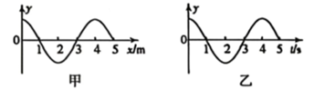
    
    A. 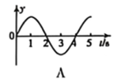
    
    B. 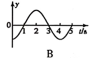
    
    C. 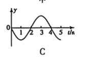
    
    D. 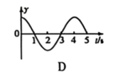

17. 某热机中一定质量的理想气体完成 $A \to B \to C \to D \to A$ 的循环过程，其体积 $V$ 和热力学温度 $T$ 的变化情况如图所示。表格中给出各过程气体吸收或放出的热量 $Q$ ($Q>0$ 表示吸热，$Q<0$ 表示放热) 及内能变化量 $\Delta U$。其中 $E$ 为已知量 ($E>0$)，$a$、$b$、$c$、$d$ 均为待求量。下列关系正确的是
    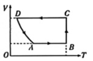
    | 过程 | $Q$ | $\Delta U$ |
    | :--- | :--- | :--- |
    | $A \to B$ | $E$ | $a$ |
    | $B \to C$ | $E$ | $b$ |
    | $C \to D$ | $c$ | $-E$ |
    | $D \to A$ | $0$ | $d$ |
A. $a=0$

B. $b=E$

C. $c=1.5E$

D. $d=0.5E$

18.  如图所示，轻质弹性绳的一端固定于 O 点，另一端系一小球，小球静止时，位于 O 点正下方的 A 点处。现对小球施加一个外力 F，使其静止在与 A 点等高的 B 点处。已知弹性绳的弹力与其伸长量成正比，外力 F 可能是图中的
    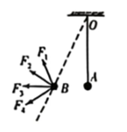
   
A. $F_1$
   
B. $F_2$
    
C. $F_3$
    
D. $F_4$

19.  如图所示为模拟远距离输电的实验电路。交流电源的输出电压一定，两变压器可视为理想变压器。升压变压器的副线圈接入电路的匝数为 $n$，滑动变阻器的接入电阻为 $r$。若发现灯泡较暗，下列操作中可能使灯泡变亮的是（多选）
    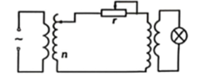
    
A. 保持 $r$ 不变，增大 $n$

B. 保持 $r$ 不变，减小 $n$

C. 保持 $n$ 不变，增大 $r$

D. 保持 $n$ 不变，减小 $r$

20.  如图所示为半圆柱形玻璃砖的截面图，$OO'$ 为其过圆心的对称轴。关于 $OO'$ 对称的两束单色细光束 a、b 从空气垂直射入玻璃砖的上表面，出射光线交于 P 点。已知光束 a、b 均由氢原子能级跃迁而产生。下列说法正确的是（多选）
    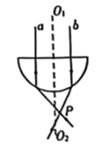  

A. 玻璃对 a 光的折射率小于对 b 光的折射率

B. 从玻璃射向空气，a 光的临界角小于 b 光的临界角

C. a 光在玻璃砖中的传播时间大于 b 光的传播时间

D. 产生 a 光的跃迁能级差小于产生 b 光的跃迁能级差

21.  如图所示，真空区域内水平边界 ab 与 cd 相距为 $h$，其间存在竖直向上的匀强电场。边界 cd 上方存在范围足够大的垂直于纸面向里的匀强磁场。M、P、N 为边界 cd 上的三点，且 $MP=L$, $PN=2L$。某时刻甲、乙两个带电粒子从 ab 边界沿电场线方向射入电场区域，然后分别由 M、N 两点同时射入磁场，最终同时被置于 P 点的粒子探测器接收。甲、乙粒子在磁场中运动的时间均为 $t$，不计粒子的重力及粒子间的相互作用。下列说法正确的是（多选）
  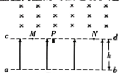
   
A. 甲、乙两粒子的比荷之比为 2:1

B. 甲粒子在电场中运动时电势能增大

C. 乙粒子在电场中的加速度为 $\frac{2L}{t^2}$

D. 乙粒子在电场中运动的时间为 $\frac{t}{2}$

---

### 三、非选择题：共 174 分。

22. (10 分) 某同学利用图示的实验装置验证动量守恒定律。气垫导轨上安装了光电门 1 和光电门 2，两个滑块上固定有完全相同的竖直挡光片，两滑块 (含挡光片) 的质量分别为 $m_1$ 和 $m_2$。实验步骤如下：
    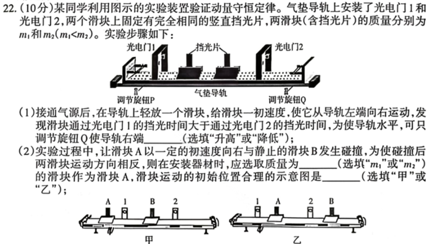
    
    (1) 接通气源后，在导轨上轻放一个滑块，给滑块一初速度，使它从导轨左端向右运动，发现滑块通过光电门 1 的挡光时间大于通过光电门 2 的挡光时间，为使导轨水平，可只调节旋钮 Q 使导轨右端 \_\_\_\_\_\_ (选填“升高”或“降低”)；
    
    (2) 实验过程中，让滑块 A 以一定的初速度向右与静止的滑块 B 发生碰撞，为使碰撞后两滑块运动方向相反，则在安装器材时，应选取质量为 \_\_\_\_\_\_ (选填"$m_1$"或"$m_2$") 的滑块作为滑块 A，滑块运动的初始位置合理的示意图是 \_\_\_\_\_\_ (选填“甲”或“乙”);
    
    (3) 按照上述的设计要求，使滑块 A 以一定的初速度沿气垫导轨运动，并与静止的滑块 B 碰撞。滑块 A 碰撞前、后其挡光片经过光电门的挡光时间分别为 $t_1$、$t_2$，滑块 B 碰撞后其挡光片经过光电门的挡光时间为 $t_3$。在实验误差允许的范围内，若满足关系式 \_\_\_\_\_\_ (用 $m_1$、$m_2$、$t_1$、$t_2$、$t_3$ 表示)，即验证了碰撞前后两滑块组成的系统动量守恒。若 \_\_\_\_\_\_ (用 $m_1$、$m_2$ 表示)，则可说明该碰撞为弹性碰撞。

23. (16 分) 某项目式学习小组设计并制作了一种利用电压表示数反映物体加速度的测量装置，其原理图如图甲所示。质量为 1kg 的滑块 2 可在内部底面光滑的水平框架 1 中水平移动，滑块两侧用劲度系数均为 100 N/m 的相同轻质弹簧拉着，滑块静止时，两弹簧均处于原长状态。$R_0$ 为粗细均匀的金属丝，3 是固定在滑块 2 中心的轻质光滑金属滑片 (宽度不计)。所用到的器材还有：电源 (电动势与内阻未知)，理想电压表 V(量程 0~3V)，电阻箱 R(0~999.9Ω)，毫米刻度尺，螺旋测微器，开关，导线等。操作步骤如下：
    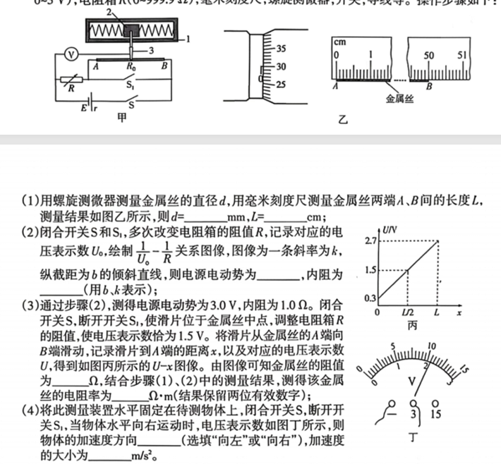
    
    (1) 用螺旋测微器测量金属丝的直径 $d$，用毫米刻度尺测量金属丝两端 A、B 间的长度 $L$，测量结果如图乙所示，则 $d=$ \_\_\_\_\_\_ mm, $L=$ \_\_\_\_\_\_ cm;
    
    (2) 闭合开关 S 和 $S_1$，多次改变电阻箱的阻值 $R$，记录对应的电压表示数 $U_0$，绘制 $\frac{1}{U_0}-R$ 关系图像，图像为一条斜率为 $k$，纵截距为 $b$ 的倾斜直线，则电源电动势为 \_\_\_\_\_\_，内阻为 \_\_\_\_\_\_ (用 $b$、$k$ 表示);
    
    (3) 通过步骤 (2)，测得电源电动势为 3.0V，内阻为 1.0Ω。闭合开关 S，断开开关 $S_1$，使滑片位于金属丝中点，调整电阻箱 R 的阻值，使电压表示数恰为 1.5V。将滑片从金属丝的 A 端向 B 端滑动，记录滑片到 A 端的距离 $x$，以及对应的电压表示数 $U$，得到如图丙所示的 $U-x$ 图像。由图像可知金属丝的阻值为 \_\_\_\_\_\_ $\Omega$，结合步骤 (1)、(2) 中的测量结果，测得该金属丝的电阻率为 \_\_\_\_\_\_ $\Omega \cdot m$ (结果保留两位有效数字)；
    
    (4) 将此测量装置水平固定在待测物体上，闭合开关 S，断开开关 $S_1$，当物体水平向右运动时，电压表示数如图丁所示，则物体的加速度方向 \_\_\_\_\_\_ (选填“向左”或“向右”)，加速度的大小为 \_\_\_\_\_\_ $m/s^2$。

24. (16 分) 某同学观看了 2026 年马年央视春晚《武 BOT》节目后，对机器人的“弹射”运动产生了浓厚的兴趣。他设计了一个弹射装置，并用质量 $m=0.5kg$ 的小球代替机器人进行测试试验。如图所示，弹射装置上表面为距离地面 $H_0=0.8m$ 的粗糙平台。小球以 $v_0=4m/s$ 的水平初速度运动到平台上时，弹射装置立即启动，使小球向上弹起 $h=0.45m$ 随后小球从平台上的 P 点斜向上抛出，达到最高点后经 $t=0.4s$ 落地，落地点与 P 点的水平距离 $x=2.1m$。小球可视为质点，空气阻力不计，重力加速度 $g$ 取 $10m/s^2$。求
    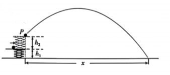
    
    (1) 小球距离地面的最大高度 $H$；
    
    (2) 小球离开 P 点瞬间的水平速度大小 $v_x$；
    
    (3) 弹射平台对小球做的功 $W$。

25. (20 分) 某科技兴趣小组用如下模型研究电磁驱动的物理原理。如图所示，水平面上分布多个宽度 $l=1m$、磁感应强度大小 $B=0.06T$ 的矩形匀强磁场区域，磁场的右边界为 PQ，自右向左从 1 区域开始依次编号，相邻磁场区域的磁场方向相反，且均垂直于水平面。将一边长 $l=1m$，匝数 $N=5$ 的正方形金属细线框 abcd 静置于水平面上 PQ 的右侧某处。$t=0$ 时刻，磁场区域整体从静止开始以 $a_0=2m/s^2$ 的恒定加速度向右运动；$t=1s$ 时，边界 PQ 恰好越过线框 cd 边，线框开始做加速运动；$t=2s$ 时，磁场开始做匀速运动；$t=14s$ 时，线框开始在磁场中做匀速运动。整个过程中线框的 cd 边始终与边界 PQ 平行。已知线框的质量 $m=0.1kg$, 电阻 $R=0.1\Omega$。线框与水平面之间的动摩擦因数 $\mu=0.1$，最大静摩擦力等于滑动摩擦力，重力加速度 $g$ 取 $10m/s^2$。不考虑因磁场运动而带来的其他影响。求
    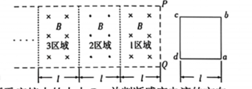
    
    (1) $t=1s$ 时，线框所受安培力的大小 $F_1$ 并判断感应电流的方向；
    
    (2) $t=2s$ 时，线框的速度大小 $v$；
    
    (3) $t=14s$ 时，线框所受安培力的功率 $P_A$ 与感应电流的功率 $P_E$ 之比；
    
    (4) $t=14s$ 时，线框 cd 边所在的磁场区域的编号 $n$。

