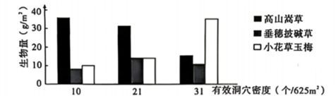
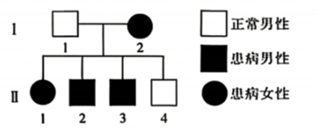
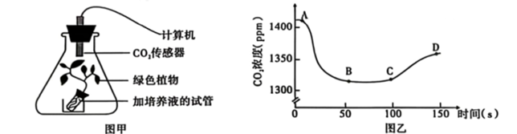
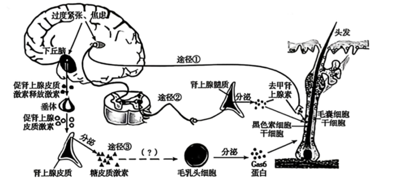
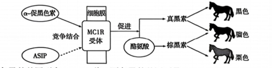
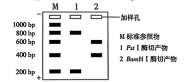

1. 玉米干酒糟是玉米经发酵生产酒精形成的残留物，含有无机盐、蛋白质、糖类、脂肪等物质，可作为鸡、鸭等家禽的饲料。下列叙述正确的是
   
    A. 玉米细胞和鸡细胞中元素的种类及含量均相同
   
    B. 将玉米干酒糟烘干后，剩余的物质主要是无机盐
    
    C. 玉米干酒糟中蛋白质被家禽消化吸收后，可参与其体内免疫活性物质的合成
   
    D. 玉米干酒糟中的糖类可在鸭细胞中大量转化为脂肪，鸭细胞中的脂肪也可大量转化为糖类

2. 胡杨根细胞的耐盐机制主要与四种载体蛋白有关。细胞膜上的载体蛋白 $H^+$-ATPase 能催化 ATP 水解继而发生磷酸化并将 $H^+$ 泵出细胞，细胞膜上的载体蛋白 $SOS_1$ 能利用 $H^+$ 顺浓度梯度运入细胞释放的能量将 $Na^+$ 逆浓度梯度运出细胞；液泡膜上的载体蛋白 V-ATPase 能利用 ATP 水解释放的能量将 $H^+$ 泵入液泡，液泡膜上的载体蛋白 NHX 能利用 $H^+$ 顺浓度梯度运出液泡释放的能量将 $Na^+$ 逆浓度梯度运入液泡。下列分析正确的是
  
    A. $H^+$-ATPase 发生磷酸化会导致 $H^+$-ATPase 空间构象的改变
   
    B. $Na^+$ 进入液泡需借助载体蛋白且不直接消耗 ATP，该过程属于协助扩散
   
    C. 四种载体蛋白的共同作用使根细胞细胞质基质中的 $Na^+$ 浓度升高
   
    D. 抑制 $H^+$-ATPase 的活性可促进 $SOS_1$ 将 $Na^+$ 运出细胞，从而提高耐盐性

3. 高原鼠兔是小型穴居哺乳动物，主要以高山嵩草等牧草为食。调查发现，高原鼠兔的有效洞穴密度越大，其种群密度越大。随有效洞穴密度增加，牧草的生物量也会发生变化，如下图所示。下列叙述错误的是
    
   
    A. 与标记重捕法相比，通过有效洞穴密度估算种群密度的方法对生物的干扰较小
   
    B. 随高原鼠兔有效洞穴密度增加，高山嵩草的生物量减少导致群落丰富度降低
   
    C. 小花草玉梅生物量增大的原因与高原鼠兔的捕食偏好和植物的种间竞争有关
   
    D. 高山嵩草同化量中的部分能量会通过高原鼠兔的粪便流向分解者

4. CAR-T 细胞是一种通过基因工程构建的 T 细胞，能与特定癌细胞精准结合并将其裂解。其构建步骤如下：①从患者体内分离纯化出 T 细胞；②将能识别癌细胞特有抗原的 CAR 蛋白的基因转入 T 细胞，得到 CAR-T 细胞；③体外培养使 CAR-T 细胞增殖，再输回患者体内。下列叙述错误的是
    
    A. 用于基因工程改造的 T 细胞最可能是细胞毒性 T 细胞
   
    B. 未经改造过的 T 细胞因缺少 CAR 蛋白，只能参与非特异性免疫
   
    C. CAR-T 细胞能识别并裂解患者体内的癌细胞，增强了机体的免疫监视功能
   
    D. 用患者自身 T 细胞进行改造，可避免由于人类白细胞抗原差异引起的免疫排斥

5. 为确定某罕见遗传病的发病原因，科研人员对患者家系部分成员进行调查，结果如下。其中 $OXRI$ 基因和 $MYOT$ 基因为两种待筛查的候选基因。
    
    

①采集Ⅰ-2 和Ⅱ-3 的线粒体 DNA 进行测序和分析，均未发现与该病表型相关的基因突变
    
②对图中 6 人的体细胞进行染色体分析，染色体数均为 46 条
    
 ③针对 $OXRI$ 基因设计引物进行 PCR 后再测序，Ⅱ-4 与Ⅰ-2 的该基因序列不同
    
 ④针对 $MYOT$ 基因设计引物进行 PCR 后再测序，Ⅱ-4 与Ⅰ-2 的该基因序列相同
    
下列分析错误的是
    
A. 根据实验结果①，推测该病与线粒体 DNA 上的基因无关
    
B. 根据实验结果②，不能确定该病是否属于染色体异常遗传病
    
C. 对 $OXRI$ 基因进行 PCR 时，用于Ⅰ-2 的引物和Ⅱ-4 的引物应相同
    
D. 根据实验结果③和④，推测该病的致病基因可能为 $MYOT$ 基因

6. 人牙齿上的牙菌斑中含有多种细菌，这些细菌大量繁殖可能会引起龋齿，其中有些细菌能利用口腔中其他微生物分解糖类产生的乳酸进行繁殖。为研究微生物与口腔健康的关系，科研人员对牙菌斑中的微生物进行纯培养。下列叙述正确的是
    
    A. 微生物产生的乳酸可以作为其他微生物的碳源和氮源
    
    B. 从牙菌斑中取样并接种在固体培养基上培养的微生物群体称为纯培养物
    
    C. 为统计牙菌斑中某种细菌数量，可在显微镜下利用细菌计数板进行观察计数
    
    D. 膳食中摄入的淀粉没有甜味，对口腔中龋齿的形成没有影响

30. (10 分) 为探究环境因素对光合作用强度的影响，某实验小组利用图甲所示密闭装置在适宜温度下进行实验，用 $CO_2$ 传感器检测装置内 $CO_2$ 浓度随时间的变化，结果如图乙所示。AC 段、CD 段分别是在光照和黑暗中进行实验的结果。回答下列问题。
    
    
    (1) 图甲中影响 $CO_2$ 传感器测量数据的细胞器主要有 \_\_\_\_\_\_。若用仅能透过红光的滤光片对甲装置进行遮光并重复实验，与未遮光时相比，AB 段的下降速率会 \_\_\_\_\_\_ (填“增大”“不变”或“减小”)。
    
    (2) 图乙中 BC 段 $CO_2$ 传感器测量数据基本保持不变的原因是 \_\_\_\_\_\_。与 A 点相比，D 点时植物干重 \_\_\_\_\_\_ (填“增大”“不变”或“减小”)。
    
    (3) 根据实验结果，若要提高温室栽培植物的产量，则需要控制的环境因素有 \_\_\_\_\_\_ (答出 2 点即可)。

31. (10 分) 人体长期处于过度紧张、焦虑等状态下会导致头发变白，下图是头发变白相关调节示意图。去甲肾上腺素作用于黑色素细胞干细胞，使黑色素细胞干细胞的储备迅速消耗，导致黑色素细胞减少，头发变白。Gas6 蛋白信号分子能维持黑色素细胞干细胞的正常功能和存活，其分泌减少会加速黑色素细胞干细胞的消耗过程，导致头发变白。回答下列问题。
    
    
    (1) 当个体处于过度紧张、焦虑等状态下，可通过途径①、②产生去甲肾上腺素，在途径①中去甲肾上腺素作为 \_\_\_\_\_\_ (物质)，行使信号分子的功能。通过途径②分泌去甲肾上腺素并发挥作用的调节方式属于 \_\_\_\_\_\_ (填“神经调节”“体液调节”或“神经 - 体液调节”)。
    
    (2) 途径③通过 \_\_\_\_\_\_ 轴的分级调节，分泌糖皮质激素，该激素对毛乳头细胞分泌 Gas6 具有 \_\_\_\_\_\_ (填“促进”或“抑制”) 作用，导致白发产生。与途径①相比，途径③调节方式的特点是 \_\_\_\_\_\_。

32. (10 分) 马鹿和狍是我国重点保护野生动物，研究团队对某自然保护区内的马鹿和狍种群进行了长期观测，以下是部分研究结果。回答下列问题。
    | 物种 | 不同生境中动物出现率 (%) | 不同生境中动物出现率 (%) | 不同生境中动物出现率 (%) | 不同生境中动物出现率 (%) | 粪便中植物表皮碎片出现率 (%) | 粪便中植物表皮碎片出现率 (%) | 粪便中植物表皮碎片出现率 (%) | 粪便中植物表皮碎片出现率 (%) | 粪便中植物表皮碎片出现率 (%) |
    | :--- | :---: | :---: | :---: | :---: | :---: | :---: | :---: | :---: | :---: |
    | | **坡位** | **坡向** | **植被类型** | **人为干扰距离** | **青楷槭** | **东北红豆杉** | **小楷械** | **青杨** | **其他植物** |
    | **马鹿** | 上坡位 31 | 阳坡 56 | 灌丛 37 | 大于 1km 21 | 19.19 | 16.64 | 9.71 | 7.64 | 46.82 |
    | | 中坡位 29 | 阴坡 19 | 针阔混交林 63 | 小于 1km 79 | | | | | |
    | | 下坡位 40 | 半阴半阳坡 25 | | | | | | | |
    | **狍** | 上坡位 15 | 阳坡 50 | 灌丛 73 | 大于 1km 63 | 20.61 | 0 | 6.77 | 15.18 | 57.44 |
    | | 中坡位 48 | 阴坡 23 | 针阔混交林 27 | 小于 1km 37 | | | | | |
    | | 下坡位 37 | 半阴半阳坡 27 | | | | | | | |
    
    (1) 马鹿和狍在生态系统营养结构中属于第 \_\_\_\_\_\_ 营养级，若保护区内东北红豆杉数量锐减，对 \_\_\_\_\_\_ (填“马鹿”或“狍”) 的影响更大，判断依据是 \_\_\_\_\_\_。
    
    (2) 数据显示，马鹿种群非均匀分布，而是呈现出明显的“斑块化”分布格局，在不同区域分布不同，主要由于 \_\_\_\_\_\_ (答出 2 点即可) 等环境因素的差异所致，体现了生物群落的水平结构。从主要生境、种间关系两方面简要描述马鹿的生态位 \_\_\_\_\_\_。
    
    (3) 在繁殖季节，雄性马鹿会通过鹿角或身体摩擦树干留下新鲜擦痕来吸引雌性，这体现了信息传递的作用是 \_\_\_\_\_\_。

33. (10 分) 家马的毛色主要分为黑色、骝色和栗色，由马毛囊中的黑色素细胞产生的真黑素和棕黑素决定，两种色素的产生机理及与毛色的对应关系见下图。这两种色素的合成受常染色体上两对独立遗传的等位基因 A、a 和 E、e 控制。E 基因控制细胞膜 MC1R 受体合成，信号分子$\alpha$-促黑色素能作用于 MC1R 受体促进酪氨酸转变成真黑素，A 基因表达的信号分子 ASIP 也能与 MC1R 受体结合，使$\alpha$-促黑色素与 MC1R 受体结合概率减小，减少真黑素的合成，使细胞中同时含有真黑素和棕黑素。E 基因存在且 A 基因不存在时，酪氨酸全部转变成真黑素。不存在 E 基因时，细胞不能合成 MC1R 受体，使真黑素不能合成，但棕黑素的合成不受影响。回答下列问题。
    
    
    (1) 骝色马的基因型有 \_\_\_\_\_\_ 种。栗色马的基因型是 \_\_\_\_\_\_。
    
    (2) 基因型为 AaEe 和 aaee 的多对亲本进行杂交，子代出现三种毛色马的原因是 \_\_\_\_\_\_。
    
    (3) 进一步研究发现，马 25 号染色体上的 G 基因内的部分碱基序列发生重复会导致黑色素细胞干细胞的异常增殖。该序列重复的次数越多，细胞发生异常增殖的概率越高，g 基因中无此变异现象。G 基因发生的这种变异属于可遗传变异中的 \_\_\_\_\_\_。真黑素与 G 基因部分序列发生重复的黑色素细胞干细胞结合，黑色素瘤发生的概率会大幅增加，据此分析，与 AaEeGg 个体相比，aaEEGG 个体患黑色素瘤的概率更高，原因是 \_\_\_\_\_\_，这可为人类黑色素瘤的研究提供重要参考。

34. (14 分) 低温冻害是农业生产中一种严重的自然灾害。研究发现，胡萝卜中含有抗冻基因 $afp$，科研人员将 $afp$ 基因成功构建为基因表达载体，以期赋予更多农作物抗冻性状。回答下列问题。
    
    (1) 科研人员利用 PCR 技术从胡萝卜的叶片中提取 $afp$ 基因，一般通过 \_\_\_\_\_\_ 的方法对 PCR 产物进行鉴定。得到的 $afp$ 基因用 $Pst\text{I}$ 或 $BamH\text{I}$ 限制酶进行酶切，检测结果如下图所示，据图分析，$afp$ 基因长度约为 \_\_\_\_\_\_ bp。
    
    
    (2) 在构建基因表达载体的过程中，受目的基因两端和载体所含限制酶识别序列的限制，科研人员先用 $EcoR\text{I}$ 限制酶处理 $afp$ 基因两端，再用某种 DNA 聚合酶补平基因两端的黏性末端，最后用 $Xba\text{I}$ 限制酶处理 $afp$ 基因的一端，使 $afp$ 基因一端是黏性末端，另一端是平末端，这样处理的目的是为了防止 \_\_\_\_\_\_。据此推测，在处理载体时，应选用的限制酶是 \_\_\_\_\_\_ (从下列选项中选择)。为提高实验效率，科研人员一般选择 \_\_\_\_\_\_ (填"$E. \text{coli}$"或"T4") DNA 连接酶构建表达载体。
    | 选项 | A | B | C | D |
    | :---: | :---: | :---: | :---: | :---: |
    | 限制酶 | $EcoR\text{I}$ | $Xba\text{I}$ | $EcoR\text{I} + Xba\text{I}$ | $Pst\text{I}$ |
    
    (3) 若科研人员已获得含 $afp$ 基因的 Ti 质粒，则运用基因工程和细胞工程技术培育抗冻番茄植株的简要实验流程是 \_\_\_\_\_\_。
